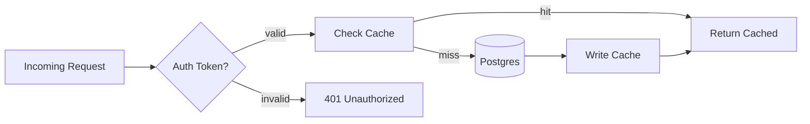
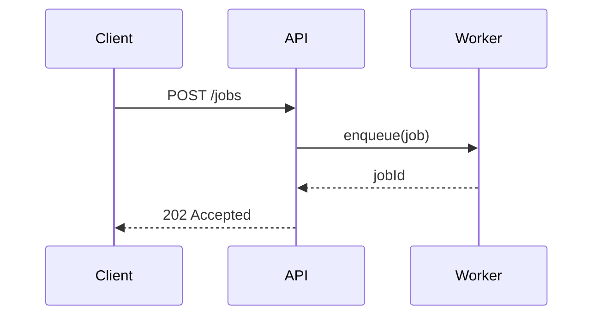

**Always obey `.docs/guides/mcp-tools.md`. Read it now if not already in context.**
**Run `/primer` first if you have not already this session.**


# Create ADR

Create a new **Architectural Decision Record** (ADR) — a short, immutable document capturing one architecturally significant decision: the context that forced the choice, the options considered, the decision made, and the consequences.

ADRs follow a hybrid of [Michael Nygard's 2011 template](https://www.cognitect.com/blog/2011/11/15/documenting-architecture-decisions) and [MADR 4.0 (2024)](https://adr.github.io/madr/). They are append-only history: when a later decision overrides an earlier one, write a **new** ADR that supersedes the old one — never rewrite the past.

---

**Decision topic**: $ARGUMENTS

---

## When to write an ADR

Write an ADR when the decision is **architecturally significant** — i.e. it affects:

| Category | Examples |
|----------|----------|
| **Structure** | Module boundaries, layering, monorepo vs polyrepo, service decomposition |
| **Non-functional characteristics** | Performance, scalability, security, observability, resilience |
| **Dependencies** | Major library/framework choice, runtime, database, message broker |
| **Interfaces** | API style (REST/GraphQL/gRPC), event schema, public contracts |
| **Construction techniques** | Build tooling, test strategy, deploy model, branching strategy |

**Skip an ADR** for: bug fixes, refactors that preserve behavior, daily operational choices, anything one engineer can change without coordination.

If the decision does not clear this bar, stop and tell the user — don't pad the record.

---

## Instructions

### Step 1: Parse the topic and recall project context

1. **Extract** the core decision question from `$ARGUMENTS`. If the topic is too vague to scope (e.g. "auth"), use `AskUserQuestion` to narrow it (e.g. "session storage strategy", "third-party identity provider choice").
2. **Recall Serena memories** that may inform the decision:
   - `mcp__serena__list_memories` (filter by topic if applicable)
   - `mcp__serena__read_memory` for any architecture, gotcha, or integration memory that touches this decision
3. **Read project context**: `CLAUDE.md`, `PROJECT_STATUS.md` (if present), and any prior ADRs in the ADR directory (see Step 2).

### Step 2: Locate the ADR directory and assign a number

1. **Find or create the ADR directory** in this priority order:
   - `.docs/adr/` (preferred for projects using `.docs/` scaffold)
   - `docs/adr/`
   - `docs/decisions/`
   - `adr/`

   If none exist, default to `.docs/adr/` and create it with a `README.md` index (see Step 6). Confirm the location with the user via `AskUserQuestion` before creating a new directory.

2. **Determine the next ADR number** by scanning existing files:
   - Use `mcp__serena__list_dir` on the chosen directory
   - Find the highest 4-digit prefix and increment by 1
   - First ADR is `0001`

3. **Derive the slug** from the decision topic: lowercase, dash-separated, ≤ 60 chars. Examples:
   - "session storage strategy" → `0007-session-storage-strategy.md`
   - "Choose async runtime for Python services" → `0012-async-runtime-for-python-services.md`

### Step 3: Research the decision

Run the `/research` workflow (see `.claude/commands/research.md`) scoped to this decision. The research must produce concrete inputs for every section of the ADR:

| ADR Section | Research must produce |
|-------------|----------------------|
| **Context** | Current state of the codebase relevant to the decision (Serena exploration), constraints from prior ADRs, business/compliance forces from `CLAUDE.md` or `PROJECT_STATUS.md` |
| **Decision Drivers** | Concrete forces: performance budgets, team skill, security requirements, ecosystem fit, deadline pressure |
| **Considered Options** | At least 2, ideally 3-5 viable options. Use Context7 for library/framework docs and Brave Search (sequential, 1/sec) for ecosystem comparisons and best-practice patterns |
| **Pros & Cons** | Each option assessed against the same criteria — never asymmetric |
| **Consequences** | What changes after the decision: new dependencies, migration cost, ongoing maintenance, what becomes harder, what becomes easier |

If any required research input cannot be filled from real evidence, **stop and report the gap** — do not invent options or fabricate consequences.

### Step 4: Clarify with the user (mandatory)

Use `AskUserQuestion` to resolve at minimum:

1. **Status to assign**: `proposed` (default — decision not yet ratified) vs `accepted` (decision is final)
2. **Recommended option**: present your research-backed recommendation with the trade-off and ask the user to confirm or override
3. **Deciders**: who owns this decision (defaults to the current git user if not specified)
4. **Supersedes**: does this ADR replace an earlier one? If so, which file?

Do not write the file until the user confirms the recommended option (or selects another).

### Step 5: Generate the ADR file

Write the ADR to `<adr-dir>/NNNN-<slug>.md` using **this exact template**. The template intentionally enforces the user's two formatting rules:

- **All option/trade-off comparisons MUST be tables**, never bullet lists
- **Mermaid flowcharts are required** when the decision involves a flow, sequence, or before/after architecture; omit only when the decision is purely a static choice (e.g. naming convention)

```markdown
# ADR NNNN: <Short Title — Verb Phrase>

- **Status**: <proposed | accepted | deprecated | superseded by ADR-NNNN>
- **Date**: YYYY-MM-DD
- **Deciders**: <names or roles>
- **Consulted**: <names or roles, optional>
- **Informed**: <names or roles, optional>
- **Supersedes**: <ADR-NNNN | none>
- **Tags**: <area-1>, <area-2>

---

## Context and Problem Statement

<2-4 sentences describing the situation that forces a decision. Write in present tense, as if explaining to a future developer who has never seen this codebase. State the problem as a question or a forced choice.>

<Link to the relevant code areas (use repo-relative paths), prior ADRs, or external constraints (compliance, contractual obligations, deadlines).>

## Decision Drivers

| # | Driver | Why it matters |
|---|--------|----------------|
| 1 | <e.g. p99 latency budget < 200ms> | <consequence if violated> |
| 2 | <e.g. team has 0 Rust experience> | <consequence if violated> |
| 3 | <e.g. must run on existing Postgres> | <consequence if violated> |

## Considered Options

| Option | One-line summary |
|--------|------------------|
| **A. <name>** | <≤ 15 words> |
| **B. <name>** | <≤ 15 words> |
| **C. <name>** | <≤ 15 words> |

### Option Comparison

Score each option against the same criteria. Use ✅ / ⚠️ / ❌ or High/Med/Low — be consistent within the table.

| Criterion | Option A | Option B | Option C |
|-----------|----------|----------|----------|
| Meets driver 1 (latency) | ✅ | ⚠️ | ❌ |
| Meets driver 2 (team skill) | ✅ | ✅ | ❌ |
| Meets driver 3 (Postgres) | ✅ | ❌ | ✅ |
| Implementation cost | Low | Med | High |
| Operational cost | Low | Low | High |
| Reversibility | Easy | Hard | Hard |
| Ecosystem maturity | High | High | Low |

### Trade-off Detail per Option

For each option, a short table — **never bullets** — capturing what's good and what's bad:

#### Option A: <name>

| Aspect | Assessment |
|--------|------------|
| Pros | <one cell, comma-separated or short prose> |
| Cons | <one cell, comma-separated or short prose> |
| Risks | <known unknowns> |
| Exit cost | <how hard to walk away later> |

#### Option B: <name>

| Aspect | Assessment |
|--------|------------|
| Pros | … |
| Cons | … |
| Risks | … |
| Exit cost | … |

#### Option C: <name>

| Aspect | Assessment |
|--------|------------|
| Pros | … |
| Cons | … |
| Risks | … |
| Exit cost | … |

## Decision Outcome

**Chosen option**: **<Option X — name>**, because <one-sentence justification anchored to the highest-priority driver>.

### Decision Flow

<Include a mermaid flowchart when the decision involves a flow, sequence, or state transition. Omit only when the decision is purely a static choice. Use one of these forms:>



<Or, for a before/after architecture decision, use two side-by-side mermaid blocks labelled "Before" and "After".>

<Or, for sequence-style decisions:>



## Consequences

| Type | Consequence |
|------|-------------|
| ✅ Positive | <e.g. eliminates current N+1 query bottleneck> |
| ✅ Positive | <e.g. unlocks horizontal scaling for the read path> |
| ⚠️ Negative | <e.g. adds Redis as a new operational dependency> |
| ⚠️ Negative | <e.g. cache invalidation logic must be maintained> |
| 🔁 Follow-up | <e.g. write task: instrument cache hit-rate metric> |
| 🔁 Follow-up | <e.g. revisit decision in 6 months once load profile is known> |

## Validation

How will we know this decision was the right one?

| Signal | Threshold | When measured |
|--------|-----------|---------------|
| <e.g. p99 latency> | < 200ms | 30 days post-deploy |
| <e.g. cache hit rate> | > 80% | weekly |

## Links

- Related ADRs: <ADR-NNNN, ADR-NNNN>
- External references: <RFCs, blog posts, library docs>
- Source task(s): <`.docs/tasks/active/NNN-slug.md`>
```

### Step 6: Maintain the ADR index

After writing the ADR file:

1. **Update or create `<adr-dir>/README.md`** as an index. Use a single table — never a bullet list:

   ```markdown
   # Architectural Decision Records

   This directory captures architectural decisions for this project. Each ADR is immutable once accepted: to change a past decision, write a new ADR that supersedes it.

   ## Index

   | # | Title | Status | Date | Supersedes |
   |---|-------|--------|------|------------|
   | [0001](0001-example.md) | Example decision | accepted | 2026-04-29 | — |
   | [NNNN](NNNN-slug.md) | <new entry> | <status> | YYYY-MM-DD | <ADR-NNNN or —> |

   ## Conventions

   - Filenames: `NNNN-short-slug.md` (4-digit zero-padded, lowercase-dashed)
   - Status lifecycle: `proposed` → `accepted` → (`deprecated` | `superseded`)
   - Comparisons are always tables, never bullet lists
   - Decision flows use mermaid diagrams
   ```

2. **If the new ADR supersedes an existing one**, use `Edit` to update the superseded ADR's status line:
   - Change `Status: accepted` to `Status: superseded by ADR-NNNN`
   - Add a note at the top: `> **Superseded by [ADR-NNNN](NNNN-slug.md)** on YYYY-MM-DD`

3. **Update the index table** to reflect the superseded record's new status.

### Step 7: Cross-link from related artifacts

If the ADR was prompted by an active task or feature work, cross-link both directions:

- In the source task file (`.docs/tasks/active/NNN-slug.md` if it exists), append: `**ADR**: [<adr-dir>/NNNN-slug.md](<relative-link>)`
- In the ADR's `## Links` section, list the source task path

Use `Read` then `Edit` for these updates — **never** `echo >>` or `sed`.

### Step 8: Update memories

If the decision establishes a non-obvious pattern, integration constraint, or known gotcha:

- `mcp__serena__write_memory` with a topic-hierarchical name (e.g. `architecture/data-layer/cache-strategy`)
- The memory should reference the ADR file path so future agents can read the full justification

Skip this step for decisions that are self-documenting via the ADR file alone.

### Step 9: Report completion

Print to the user:

1. ADR file path
2. Status assigned, deciders, supersedes (if any)
3. Whether index was created or updated
4. Whether any task or memory was cross-linked
5. Suggested next steps:
   - If status is `proposed`: "Circulate the ADR for review, then update status to `accepted` once ratified."
   - If status is `accepted`: "Implement via `/add-task <description>` referencing this ADR."

---

## Output Formatting Rules (mandatory — these override any default style)

1. **All comparisons are tables.** No bullet-list pros/cons, no bullet-list option summaries, no bullet-list trade-offs. If you find yourself writing `- Good, because ...` / `- Bad, because ...`, stop and convert to a table row.
2. **Use mermaid for any flow, sequence, or before/after architecture.** Static choices (naming, file layout) may skip mermaid. When in doubt, include it — diagrams age well.
3. **One decision per ADR.** If the topic spans multiple decisions, split into multiple ADR files and cross-link them in the `## Links` section.
4. **Present tense, full sentences.** "We will use Redis as the session cache." Not "Redis chosen" or "Going with Redis I think".
5. **Immutable once accepted.** Never edit an accepted ADR's content — write a superseding ADR instead. Status changes (accepted → superseded) are the only allowed in-place edits.

---

## CRITICAL Rules

1. **Maximum 3 sub-processes at a time** if delegating research steps
2. **Always terminate processes when done** (dev servers, type checkers)
3. **Never invent options or consequences** — every option in the table must be backed by Step 3 research; every consequence must be a real implication, not aspirational copy
4. **Tables not bullets** for every comparison — this is a hard rule, not a preference
5. **Mermaid for flows** — include a diagram unless the decision is purely static
