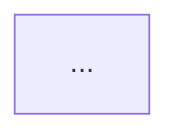

**Always obey `.docs/guides/mcp-tools.md`. Read it now if not already in context.**
**Run `/primer` first if you have not already this session.**


# Create ADR

Create a new **Architectural Decision Record** (ADR) file. An ADR file is a **Decision Group** — one or more architecturally significant decisions that share context and are documented together. Each decision tracks its own `Status`, `Date`, `Deciders`, `Tags`, and supersession independently.

ADRs follow a hybrid of [Michael Nygard's 2011 template](https://www.cognitect.com/blog/2011/11/15/documenting-architecture-decisions) and [MADR 4.0 (2024)](https://adr.github.io/madr/), extended with this project's per-decision status model. They are append-only history: when a later decision overrides an earlier one, write a **new** decision (in a new file or as a new `D*` block in an existing related file) that supersedes the old one — never rewrite the past.

**Read `<adr-dir>/README.md` first** (typically `.docs/adr/README.md`). It defines the Decision Group model, the supersession rule, the relationship graph, and the index format this command must respect.

---

**Topic**: $ARGUMENTS

---

## When to write an ADR

See `<adr-dir>/README.md` for the canonical "When to Write" / "When NOT to Write" tables. In short: write an ADR when at least one decision in the topic affects structure, NFRs, dependencies, interfaces, or construction techniques — and is hard to reverse. Skip for bug fixes, refactors, naming, or trivially reversible choices.

If the decision does not clear that bar, stop and tell the user — don't pad the log.

---

## Instructions

### Step 1: Parse the topic and recall project context

1. **Extract** the core topic from `$ARGUMENTS`. If the topic is too vague (e.g. "auth"), use `AskUserQuestion` to narrow it.
2. **Decide single-decision vs Decision Group** — see Step 1.5.
3. **Recall Serena memories** that may inform any decision in the group:
   - `mcp__serena__list_memories` (filter by topic if applicable)
   - `mcp__serena__read_memory` for any architecture/gotcha/integration memory that touches the topic
4. **Read project context**: `CLAUDE.md`, `PROJECT_STATUS.md` (if present), and the ADR directory's `README.md` (the index) plus a sample of recent ADRs to learn local conventions.

### Step 1.5: Single-decision vs Decision Group triage

Ask the user (or decide from `$ARGUMENTS`) whether the file will hold one decision or several. Use the README's "When to Group vs Split" table:

| Signal | Group into one file | Split (this command writes one decision now; user invokes `/create-adr` again later) |
|--------|--------------------|--------------------------------------------------------------------------------------|
| Shared context, drivers, deciders | ✅ Group | — |
| Tightly coupled (one constrains the next) | ✅ Group | — |
| Different decision areas with little overlap | — | ✅ Split |
| Different audiences / timelines | — | ✅ Split |
| One is much larger than the others | — | ✅ Split |

Default to **single-decision** unless `$ARGUMENTS` starts with `group:` or the user explicitly lists multiple decisions. When in doubt, ask via `AskUserQuestion` with the table above visible. If grouping, request a list of the decisions (one short title each, 2-6 entries).

### Step 2: Locate the ADR directory and assign a number

1. **Find or create the ADR directory** in priority order:
   - `.docs/adr/` (preferred for projects using `.docs/` scaffold)
   - `docs/adr/`
   - `docs/decisions/`
   - `adr/`

   If none exist, default to `.docs/adr/` and create it with a `README.md` index. Confirm via `AskUserQuestion` before creating a new directory.

2. **Read the directory's `README.md`** to learn the current chain, decision-area conventions, and relationship graph.

3. **Determine the next file number**: scan existing files via `mcp__serena__list_dir`, find the highest 4-digit prefix, increment by 1. First ADR is `0001`.

4. **Derive the file slug** — names the **group**, not a single decision. Lowercase, dash-separated, ≤ 60 chars:
   - Single decision "session storage strategy" → `0007-session-storage-strategy.md`
   - Group covering session lifetime + storage + invalidation → `0007-session-management.md`

### Step 2.5: Detect existing decision area (per-decision supersession check)

Before drafting, determine whether each planned decision enters a decision area that already has an `accepted` decision somewhere in the log. The README's supersession rule operates **per decision**: each `D*` block must check independently.

**For each planned decision in the group:**

1. Read every existing ADR file in the directory (use `mcp__serena__list_dir`, then `Read` each)
2. For each existing decision block (`D1`, `D2`, …) with status `accepted`, compare:

   | Tier | Signal | Detection |
   |------|--------|-----------|
   | 1 | Tag overlap | ≥ 1 shared tag with the planned decision |
   | 2 | Decision-title noun overlap | Substantial overlap |
   | 3 | File-slug stem overlap | Only relevant when both are single-decision files |

3. Build a candidate-supersession table per planned decision:

   | Planned Decision | Existing Decision | Overlap Tier | Likely Same Area? |
   |------------------|-------------------|--------------|-------------------|
   | (group D1) Session storage backend | ADR-0003#D2 | Tag | Yes |
   | (group D2) Session lifetime | (none) | — | No |

4. If any row is `Yes`/`Maybe`, surface to the user in Step 4 and offer to set `Supersedes` on that block. Otherwise the block enters a fresh area.

This check is mandatory — it prevents accidentally creating two parallel `accepted` decisions in the same area, which breaks the chain.

### Step 3: Research each decision

Run the `/research` workflow per **decision**, not per file. Each block must produce concrete inputs:

| ADR Section (per decision) | Research must produce |
|----------------------------|----------------------|
| **Context** | Code state relevant to *this decision*; constraints from prior ADRs; business/compliance forces |
| **Decision Drivers** | Concrete forces specific to this decision: performance budgets, team skill, security, ecosystem fit, deadline |
| **Considered Options** | ≥ 2 viable options. Use Context7 for library/framework docs, Brave Search (1/sec, sequential) for ecosystem patterns |
| **Pros & Cons** | Symmetric assessment per option |
| **Consequences** | Real follow-on: new dependencies, migration cost, what becomes harder/easier |
| **Validation** | Measurable signal + threshold + timeframe (E-C-A-D-R "R") |

Decisions in the same group may share evidence sources (Shared Context handles that), but each block needs its own drivers, options, and consequences.

If any block lacks evidence for an option or driver, **drop the option/driver from that block** rather than fabricating. Note the gap in the Step 9 report.

### Step 4: Clarify with the user (mandatory)

Use `AskUserQuestion` to resolve, **for each decision in the group**, at minimum:

| # | Question | Notes |
|---|----------|-------|
| 1 | **Status to assign at draft time** | Strongly prefer `proposed` (default). Each decision can be a different status if needed |
| 2 | **Recommended option** | Present research-backed recommendation with the comparison table; user confirms or overrides |
| 3 | **Deciders** | Who owns *this decision* (may differ per block); defaults to current git user |
| 4 | **Tags (mandatory, non-empty)** | 1-3 short tags identifying the decision area for *this block*. Required for future supersession detection |
| 5 | **Supersedes** | If Step 2.5 surfaced candidates for this block, ask which (if any) it supersedes. `ADR-NNNN#DM`, `none`, or "decide at finalize time" |

**Refuse to write the file if any decision block has empty `Tags`.**

For Decision Groups, ask all decisions' questions in a single AskUserQuestion batch when feasible to minimize round-trips, but keep questions per-decision (not collapsed into "the group's deciders").

### Step 5: Generate the ADR file

Write the ADR to `<adr-dir>/NNNN-<group-slug>.md` using **this template**. The two formatting rules — tables only, mermaid for flows — are mandatory in every decision block.

```markdown
# ADR NNNN: <Decision-Group Title>

> Decision Group covering <area-1>, <area-2>, <area-3>.

- **File created**: YYYY-MM-DD
- **Last updated**: YYYY-MM-DD
- **Tags (group)**: <umbrella tags shared by all decisions, optional>

## Shared Context

<Context that applies to every decision in this group. Avoid restating in each block.>

<Link to relevant code areas (repo-relative paths), prior ADRs (`ADR-NNNN#DM`), or external constraints.>

---

## D1. <Short Title — Verb Phrase>

- **Status**: <proposed | accepted | deprecated | superseded by ADR-XX#DY>
- **Date**: YYYY-MM-DD
- **Deciders**: <names or roles>
- **Consulted**: <names or roles, optional>
- **Informed**: <names or roles, optional>
- **Supersedes**: <ADR-MMMM#DK | none>
- **Tags**: <area-1>, <area-2>

### Context (decision-specific)

<Anything that applies to D1 but not to siblings. Reference Shared Context when possible.>

### Decision Drivers

| # | Driver | Why it matters |
|---|--------|----------------|
| 1 | <e.g. p99 latency budget < 200ms> | <consequence if violated> |
| 2 | <...> | <...> |

### Considered Options

| Option | One-line summary |
|--------|------------------|
| **A. <name>** | <≤ 15 words> |
| **B. <name>** | <≤ 15 words> |
| **C. <name>** | <≤ 15 words> |

### Option Comparison

| Criterion | Option A | Option B | Option C |
|-----------|----------|----------|----------|
| Meets driver 1 | ✅ | ⚠️ | ❌ |
| Meets driver 2 | ✅ | ✅ | ❌ |
| Implementation cost | Low | Med | High |
| Operational cost | Low | Low | High |
| Reversibility | Easy | Hard | Hard |

### Trade-off Detail per Option

#### Option A: <name>

| Aspect | Assessment |
|--------|------------|
| Pros | <one cell, comma-separated or short prose> |
| Cons | <one cell> |
| Risks | <known unknowns> |
| Exit cost | <how hard to walk away later> |

#### Option B: <name>

| Aspect | Assessment |
|--------|------------|
| Pros | … |
| Cons | … |
| Risks | … |
| Exit cost | … |

#### Option C: <name>

| Aspect | Assessment |
|--------|------------|
| Pros | … |
| Cons | … |
| Risks | … |
| Exit cost | … |

### Decision Outcome

**Chosen option**: **<Option X — name>**, because <one-sentence justification anchored to the highest-priority driver>.

### Decision Flow

<Include a mermaid block when the decision involves a flow, sequence, or state transition. Skip only for purely static choices.>



### Consequences

| Type | Consequence |
|------|-------------|
| ✅ Positive | <e.g. eliminates current bottleneck> |
| ⚠️ Negative | <e.g. adds new operational dependency> |
| 🔁 Follow-up | <e.g. write task: instrument metric> |

### Validation

| Signal | Threshold | When measured |
|--------|-----------|---------------|
| <e.g. p99 latency> | < 200ms | 30 days post-deploy |

### Links

- Related decisions: ADR-NNNN#DM, ADR-NNNN#DM
- Supersedes: ADR-MMMM#DK (if applicable)
- Source task(s): `.docs/tasks/active/NNN-slug.md`

---

## D2. <Short Title of Decision 2>

- **Status**: <independent of D1>
- **Date**: ...
- **Deciders**: ...
- **Consulted**: ...
- **Informed**: ...
- **Supersedes**: ...
- **Tags**: ...

### Context (decision-specific)
...

<repeat full block structure>

---

## D3. ...
```

**Single-decision files** simply have one `D1` block and no `D2`/`D3`. The `Shared Context` may be merged into D1's `### Context` or omitted in that case.

### Step 6: Maintain the ADR index and graph

After writing the ADR file, update `<adr-dir>/README.md`:

1. **Add one row to the Index per decision in the new file** (a 3-decision file adds 3 rows). Columns: `File`, `Decision`, `Title`, `Decision Area`, `Status`, `Date`, `Deciders`, `Supersedes`, `Superseded By`. See README's index column spec.

2. **If any decision was created with status `accepted` AND supersedes an existing decision** (rare — Step 4 #1 was set to `accepted`), apply the README's two-block cross-reference rule per affected pair. The atomic update covers:

   | Site | Edit |
   |------|------|
   | Superseded decision block | `Status: accepted` → `Status: superseded by ADR-N#DX`; insert callout `> **Superseded by [ADR-N#DX](NNNN-slug.md#dX-...)** on YYYY-MM-DD` directly under that decision's H2 |
   | Superseded decision's siblings | **Untouched** — sibling decisions retain their own status |
   | New decision block | `Supersedes` metadata set; `### Links` references the superseded `ADR-MMMM#DK` |
   | Index | Two rows updated (the superseder's row gets `Supersedes`, the superseded's row gets `Status` and `Superseded By`) |
   | Relationship Graph | New node added; supersession edge drawn; superseded node's class flipped |

   **Default to `proposed`.** Supersession at create-time is rare; `/finalize-adr` enforces it atomically when the user is ready.

3. **Do not delete or mutate any existing index row** beyond what supersession requires. The index is append-mostly.

### Step 7: Cross-link from related artifacts

For any decision in the group that was prompted by an active task or feature work, cross-link both directions:

- In the source task file (`.docs/tasks/active/NNN-slug.md` if it exists), append: `**ADR**: ADR-NNNN#DM ([file](<relative-link>))`
- In the decision's `### Links` section, list the source task path

Use `Read` then `Edit` for these updates — **never** `echo >>` or `sed`.

### Step 8: Update memories

If a decision in the group establishes a non-obvious pattern, integration constraint, or known gotcha:

- `mcp__serena__write_memory` with a topic-hierarchical name (e.g. `architecture/data-layer/cache-strategy`)
- The memory body should reference the specific decision (`ADR-NNNN#DM`), not just the file

Skip for self-documenting decisions.

### Step 9: Report completion

Print a tabular summary:

| Field | Value |
|-------|-------|
| File path | `<adr-dir>/NNNN-slug.md` |
| Decisions in this file | `D1: <title>`, `D2: <title>`, … |
| Status assigned per decision | per-decision list |
| Supersession queued for finalize? | yes (per decision) / no |
| Index updated | yes (N rows added) |
| Graph updated | yes / no (only if status=accepted at draft) |
| Suggested next steps | `/finalize-adr <file>#D1`, `/finalize-adr <file>#D2`, … |

If any decision was dropped due to lack of evidence, note it in a separate "Gaps" section.

---

## Output Formatting Rules (mandatory — these override any default style)

1. **All comparisons are tables.** No bullet-list pros/cons, no bullet-list option summaries. If you find yourself writing `- Good, because ...` / `- Bad, because ...`, stop and convert to a table row.
2. **Use mermaid for any flow, sequence, or before/after architecture.** Static choices may skip. When in doubt, include — diagrams age well.
3. **One decision per `D*` block.** A single `D*` block must NOT cover two decisions. Split into `D1` and `D2`.
4. **Stable decision IDs.** Once a decision is `D2`, it stays `D2` forever — even if `D1` is later marked `deprecated`. Never renumber siblings.
5. **Present tense, full sentences.** "We will use Redis as the session cache." Not "Redis chosen" or "Going with Redis I think".
6. **Immutable per decision once accepted.** Never edit an accepted decision block's content — create a new decision (in this file as `Dnext` or in a new file) that supersedes it. Status changes (accepted → superseded) and the supersession callout are the only allowed in-place edits.

---

## CRITICAL Rules

1. **Maximum 3 sub-processes at a time** if delegating research steps
2. **Always terminate processes when done** (dev servers, type checkers)
3. **Never invent options or consequences** — every option in a block's tables must be backed by Step 3 research; every consequence must be a real implication
4. **Tables not bullets** for every comparison — hard rule, not a preference
5. **Mermaid for flows** — include a diagram unless the decision is purely static
6. **Per-decision metadata is mandatory** — `Status`, `Date`, `Deciders`, `Tags` cannot be empty on any block; `Tags` non-empty is required for supersession detection
7. **Decisions in a group are independent units** — never assume sibling status, sibling deciders, or sibling supersession on behalf of a block
