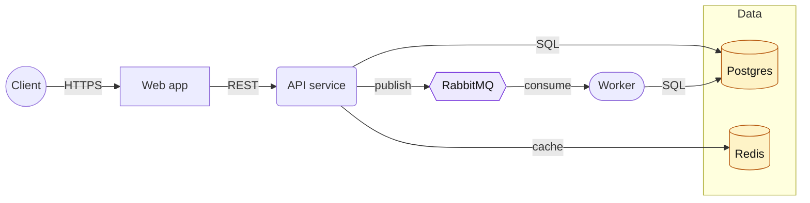

**Always obey `.docs/guides/mcp-tools.md`. Read it now if not already in context.**
**Run `/primer` first if you have not already this session.**

# Mermaid Flowchart

Read a source file at the path supplied in `$ARGUMENTS`, distill it into a structured set of nodes and edges, and emit a **Markdown file containing a Mermaid `flowchart` block** that visualizes the architecture, services, or component relationships.

---

**Source / args**: `$ARGUMENTS`

The first whitespace-separated token is the **input path** (required). An optional second token is the **output path**. If not provided, derive `<input-stem>.flowchart.md` next to the input file (e.g. `architecture.md` → `architecture.flowchart.md`, `docker-compose.yml` → `docker-compose.flowchart.md`).

If `$ARGUMENTS` is empty, ask the user for the input path before proceeding.

---

## Phase 1 — Read & Detect Type

1. Read the input file with `Read` (markdown / YAML / config). Never `cat`/`head`. For source code referenced from the architecture doc, use `mcp__serena__get_symbols_overview` if you need to verify a claim.
2. **Detect the input shape** — your extraction strategy depends on this:
   - **Docker Compose YAML** (filename contains `docker-compose` or top-level `services:` key with `image:`/`build:` children) → use the Docker Compose extraction rules in Phase 2A.
   - **Generic YAML / config** (Kubernetes manifests, Terraform-ish, CI configs, `serverless.yml`, etc.) → use the Generic YAML extraction rules in Phase 2B.
   - **Markdown architecture doc** → use the Markdown extraction rules in Phase 2C.
3. If the file is ambiguous (e.g. markdown that embeds a compose snippet), pick the dominant content type and treat embedded snippets as supplementary.

## Phase 2 — Extract Nodes & Edges

Aim for **5–25 nodes**. If the source has more, group related items into subgraphs and collapse leaf detail. Fewer than 5 means the diagram is probably not worth drawing — ask the user whether to proceed.

### 2A — Docker Compose

For each top-level `services.<name>`:

- **Node** = the service. Pick a shape:
  - Database images (`postgres`, `mysql`, `mongo`, `redis`, `mariadb`, `cockroach`, etc.) → cylinder `[(name)]`
  - Message brokers / queues (`rabbitmq`, `kafka`, `nats`, `redis` used as broker) → hexagon `{{name}}`
  - Web/API/app services → rounded rectangle `(name)` or rectangle `[name]`
  - Reverse proxies / load balancers (`nginx`, `traefik`, `caddy`, `haproxy`) → parallelogram `[/name\]`
  - Workers / cron / one-shot jobs → stadium `([name])`
- **Edges** from explicit relationships:
  - `depends_on:` → `dependent --> dependency`
  - `links:` (legacy) → same as depends_on
  - Env vars that reference another service hostname (e.g. `DATABASE_URL=postgres://db:5432`) → labelled edge `app -->|sql| db`
  - `ports:` exposed to host → add an external entry node `Client((Client))` with edge `Client -->|:8080| app`
- **Subgraphs** for `networks:` if more than one network is defined. Otherwise omit.
- **Volumes** are usually noise — only include when a named volume connects multiple services or the user explicitly wants storage shown.

### 2B — Generic YAML / Config

Look for the structural patterns the file uses to define components:

- Top-level lists or maps of named items (`resources:`, `components:`, `functions:`, `pipelines:`, `jobs:`, `steps:`) → each item is a candidate node.
- Cross-references (a value that names another key in the file) → candidate edge.
- For Kubernetes: `Deployment` / `StatefulSet` / `Service` / `Ingress` → nodes; `selector` / `serviceName` / `backend.service.name` → edges.
- For CI configs (`needs:`, `requires:`, `dependsOn:`) → DAG edges.

If the file's structure is unclear, summarize what you found and ask the user which level of detail to render before writing the deck.

### 2C — Markdown Architecture Doc

Scan headings and prose for:

- Lists of components, services, modules, layers — each becomes a node.
- ASCII art diagrams (e.g. `[A] -> [B]`) — translate them directly.
- Phrases that imply edges: "X calls Y", "X publishes to Y", "Y subscribes from X", "data flows from X to Y", "X depends on Y", "X writes to Y", "Y reads from X".
- Existing Mermaid blocks — if the doc already contains one, treat it as the source of truth and *enhance* rather than reinvent (e.g. add missing edges from prose, normalize node IDs).

Group nodes into subgraphs when the doc uses section headings like "Frontend", "Backend", "Data layer", "External services" — those headings usually map cleanly onto subgraph boundaries.

## Phase 3 — Plan the Diagram

Decide before writing:

- **Direction**: `TD` (top-down) for layered architectures (client → app → data); `LR` (left-right) for pipelines, request flows, or DAGs with many sequential steps. Default to `LR` for compose files, `TD` for layered markdown architectures.
- **Subgraphs**: group nodes that share a tier, network, or bounded context. Do not nest subgraphs more than 2 deep — Mermaid renders them poorly.
- **Edge labels**: add a short label (`-->|HTTP|`, `-->|gRPC|`, `-->|publishes|`) when the edge type is non-obvious. Skip labels when every edge is the same kind ("depends on") — the diagram is cleaner without them.
- **Styling**: define 2–4 classes for visual grouping (e.g. `classDef db fill:#fef3c7,stroke:#b45309;`). Don't go beyond 4 — more becomes noise.
- **External actors**: if requests originate from outside the system, add a `Client((Client))` or `User((User))` node so the entry point is explicit.

## Phase 4 — Write the Output

Use the `Write` tool to create the output markdown file. The file **must** follow this template:

````markdown
# {Title derived from source filename or H1 of source}

> Auto-generated from `{relative path to source}` by `/mermaid-flowchart`.



## Notes

- {1–4 short bullets capturing assumptions, ambiguities, or items the source did not specify}
- {Any `<!-- TODO: verify ... -->` items should also be summarized here}
````

Key rules:

- The mermaid block must use a fenced code block tagged ` ```mermaid `. GitHub, GitLab, Obsidian, and the VS Code Markdown Preview Mermaid Support extension all render this.
- Open the diagram with `flowchart TD` or `flowchart LR` (not the legacy `graph` keyword).
- **Node IDs** are alphanumeric, no spaces, no hyphens. Use the display label inside brackets: `WebApp[Web app]`. Reuse the same ID consistently — Mermaid silently creates duplicate nodes if you typo an ID.
- **Edges**: `-->` solid, `-.->` dotted (use for async/optional), `==>` thick (use for hot path). Labels: `-->|label|`. Keep labels under ~20 characters.
- **Subgraphs**: `subgraph Name ... end`. Do not put `flowchart` direction inside a subgraph unless it differs from the parent (Mermaid supports per-subgraph direction with `direction TD`, but use sparingly).
- **No raw HTML** inside node labels except `<br/>` for line breaks. Quote labels with special characters: `Node["label: with colon"]`.
- **Comments** with `%%` are allowed and useful for sectioning the source. They render as nothing.

### Node shape cheatsheet

| Shape | Syntax | Use for |
|-------|--------|---------|
| Rectangle | `A[Label]` | Generic component, service, module |
| Rounded | `A(Label)` | App / process / API |
| Stadium | `A([Label])` | Worker, job, scheduled task |
| Subroutine | `A[[Label]]` | Library, internal package |
| Cylinder | `A[(Label)]` | Database, persistent store |
| Circle | `A((Label))` | External actor (Client, User) |
| Hexagon | `A{{Label}}` | Queue, broker, event bus |
| Rhombus | `A{Label}` | Decision / branch |
| Parallelogram | `A[/Label\]` | Load balancer, gateway, ingress |
| Trapezoid | `A[/Label/]` | Input / output |

## Phase 5 — Best-practice Checklist

Before calling `Write`, mentally verify:

- [ ] First line of the mermaid block is `flowchart TD` or `flowchart LR`
- [ ] Every node ID is alphanumeric and reused consistently
- [ ] No more than ~25 nodes; if exceeded, group into subgraphs or split into multiple diagrams
- [ ] Subgraphs are at most 2 levels deep
- [ ] At most 4 `classDef` styles; classes are actually applied with `class A,B name;`
- [ ] Edge labels are short and only present where the edge type is non-obvious
- [ ] No raw HTML other than `<br/>`; labels with `:` `#` `(` `)` are wrapped in `"..."`
- [ ] External actors / entry points are explicitly drawn (Client, User, External API)
- [ ] No claims that aren't in the source — ambiguous items are flagged in the **Notes** section, not invented in the diagram
- [ ] Output filename ends in `.flowchart.md` and lives next to the source unless the user gave an explicit path

## Phase 6 — Write & Confirm

1. `Write` the file to the output path.
2. Print a short summary to the user:
   - Output path
   - Node count, edge count, subgraph count
   - Preview suggestion: open in any Markdown viewer that renders Mermaid (GitHub, GitLab, Obsidian, VS Code with **Markdown Preview Mermaid Support**), or render to SVG via `npx @mermaid-js/mermaid-cli -i <output>.flowchart.md -o diagram.svg`.

---

## CRITICAL Rules

1. **Never** modify the source file — only read it.
2. Use `Read` for markdown/YAML/config source. Use Serena MCP only if you need to cross-check a code symbol referenced from the architecture doc.
3. Use `Write` (not `Edit`) to create the output — it's a new file.
4. Do not invent components, services, or relationships not present in the source. If a relationship is implied but not explicit, mark it with a `%% TODO: verify` comment in the mermaid block and call it out in the **Notes** section.
5. If the source describes more than ~25 components, ask the user whether to (a) collapse via subgraphs, (b) emit multiple diagrams in one file, or (c) limit to a single tier — do not silently truncate.
6. Maximum of 3 sub-processes if you delegate extraction. Always terminate.
