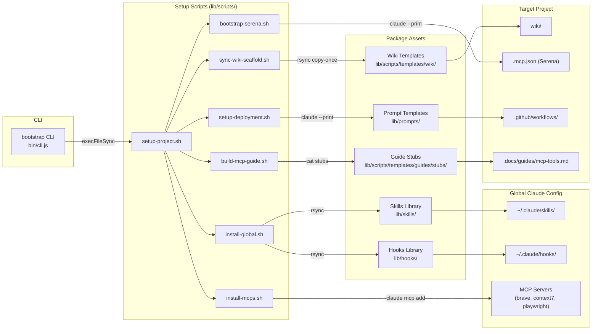
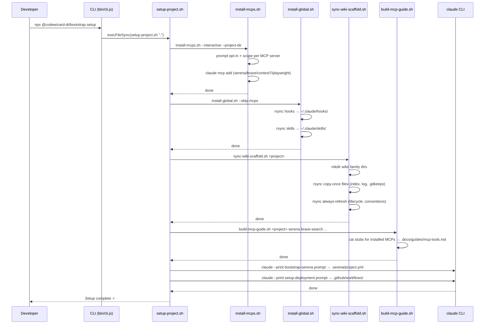

# @codewizard-dt/bootstrap

Bootstrap Claude Code projects with an **LLM Wiki**, reusable skills, hooks, and 4 MCP servers — in a single command.

**Repository:** https://github.com/codewizard-dt/bootstrap-wiki

## Description

`@codewizard-dt/bootstrap` eliminates the repetitive scaffolding required to configure Claude Code for a new project. A single `npx @codewizard-dt/bootstrap setup` installs four MCP servers (Brave Search, Context7, Playwright, and Serena), copies 60+ custom slash command skills and PreToolUse/PostToolUse hook scripts globally, scaffolds a structured LLM Wiki into the target project, assembles a project-specific MCP tools guide from per-server stubs, and wires up CI/CD workflows — all idempotently, so re-running it is always safe.

The core innovation is the **LLM Wiki**: a three-layer knowledge architecture (immutable `raw/` sources, LLM-owned `wiki/`, and schema in `CLAUDE.md`) that gives Claude unambiguous, structured context across every session. All project state lives in markdown files with defined schemas — task files, architecture decision records, UAT specs, roadmaps — so any agent in any context window can pick up work mid-flight without needing to be re-briefed.

The package dogfoods its own scaffold: the `wiki/` in this repo was instantiated by running `sync-wiki-scaffold.sh`, and the 60+ skills in `lib/skills/` span the full development lifecycle from requirements through deployment — shipped globally via rsync and invocable from any Claude Code session as `/slash-commands`.

## Architecture

### Overview

`@codewizard-dt/bootstrap` is a **CLI tool and configuration template package** — there is no running server. The CLI (`bin/cli.js`) routes `npx` commands to bash scripts; the bash scripts orchestrate interactive MCP installs, rsync operations, per-project guide assembly, and Claude-driven scaffolding. At runtime in target projects, the installed hooks and skills become part of the Claude Code agent session, enforcing LSP-first navigation and providing the full slash command vocabulary.

### Components

#### CLI Entry Point

- **Responsibility:** Routes `npx @codewizard-dt/bootstrap <command>` invocations to the correct bash script in `lib/scripts/`.
- **Tech:** Node.js (`child_process.execFileSync`)
- **Inputs:** CLI command name (`setup`, `update`, `install`, `deploy`, `migrate`, `typechecks`) and optional extra arguments
- **Outputs:** Delegates to a shell script with inherited stdio and correct exit-code propagation
- **Depends on:** Setup Scripts

#### Setup Scripts

- **Responsibility:** Orchestrate the full installation and scaffolding pipeline — interactive MCP configuration, global hooks and skills, wiki scaffold, dynamic MCP guide assembly, Serena registration, and CI/CD.
- **Tech:** Bash, rsync, `claude` CLI
- **Inputs:** Target project path; `BRAVE_API_KEY` / `CONTEXT7_API_KEY` env vars; stdin for interactive prompts
- **Outputs:** MCP server registrations in `~/.claude/`, skills in `~/.claude/skills/`, hooks in `~/.claude/hooks/`, wiki structure and assembled `mcp-tools.md` in target project, `.mcp.json` for Serena, `.github/workflows/` CI/CD
- **Depends on:** MCP Installer, Skills Library, Hooks Library, Wiki Scaffold Templates, Guide Stubs, Prompt Templates, `claude` CLI

#### MCP Installer (`install-mcps.sh`)

- **Responsibility:** Install and configure MCP servers (Serena, Brave Search, Context7, Playwright) in either interactive mode (per-server opt-in with scope selection) or non-interactive mode (install all silently).
- **Tech:** Bash, `claude mcp add`
- **Inputs:** `--interactive` flag, optional `--project-dir`; API keys from env or interactive prompts
- **Outputs:** MCP server entries in `~/.claude/` (user scope) or `<project>/.mcp.json` (project scope)
- **Depends on:** `claude` CLI

#### Guide Builder (`build-mcp-guide.sh`)

- **Responsibility:** Assemble a project-specific `.docs/guides/mcp-tools.md` from per-server stub files, including only the MCP servers actually installed in the target project.
- **Tech:** Bash, `cat` assembly from markdown stubs
- **Inputs:** Target project path and list of installed MCP names (`serena`, `brave-search`, `context7`, `playwright`)
- **Outputs:** `.docs/guides/mcp-tools.md` tailored to the project's installed MCP set
- **Depends on:** Guide Stubs

#### Skills Library

- **Responsibility:** Provide 60+ Claude Code slash command definitions covering requirements, decisions, tasks, UAT, bugs, roadmaps, research, flashcards, and utilities — installed globally so they are available in every project.
- **Tech:** Markdown (`SKILL.md` files read by Claude Code's skills system from `~/.claude/skills/`)
- **Inputs:** User-typed `/skill-name [args]` in Claude Code
- **Outputs:** Structured agent behavior — file creation, wiki updates, test execution, code review, research reports, interactive flashcard HTML pages
- **Depends on:** Serena MCP, Brave Search MCP, Context7 MCP (resolved at runtime in target projects)

#### Hooks Library

- **Responsibility:** Enforce Serena-first LSP navigation and safety policies via PreToolUse/PostToolUse/SessionStart hooks that fire in all permission modes, including `bypassPermissions`.
- **Tech:** Node.js hook scripts; shared library in `lib/hooks/lib/`
- **Inputs:** Tool calls from Claude (Read, Write, Edit, Bash, Grep, Glob, Agent)
- **Outputs:** Block messages with Serena-equivalent suggestions, or pass-through; writes nav-state to `~/.claude/state/` for gate decisions
- **Depends on:** `.serena/project.yml` (for language scoping), `lib/hooks/lib/serena.js`

#### Prompt Templates

- **Responsibility:** Provide structured Claude prompt instructions for AI-driven scaffolding operations — CI/CD workflow generation, strict typecheck setup, and wiki migration — where static templates would be too brittle.
- **Tech:** Markdown (read by bash scripts and passed to `claude --print`)
- **Inputs:** Target project context and CLI extra arguments
- **Outputs:** Claude Code agent actions — file creation, git operations, frontmatter synthesis
- **Depends on:** `claude` CLI

#### Wiki Scaffold Templates

- **Responsibility:** Define the canonical LLM Wiki directory structure and lifecycle specification files instantiated into every target project.
- **Tech:** Markdown skeleton files with copy-once vs. always-refresh delivery policies
- **Inputs:** `sync-wiki-scaffold.sh` rsync invocations
- **Outputs:** `wiki/knowledge/` and `wiki/work/` family trees, lifecycle specs, `conventions.md`, and index/log stubs in target projects
- **Depends on:** None

#### Guide Stubs

- **Responsibility:** Per-MCP-server reference guide fragments assembled by `build-mcp-guide.sh` into a project-specific MCP tools guide on every setup/update run.
- **Tech:** Markdown stub files in `lib/scripts/templates/guides/stubs/`
- **Inputs:** `build-mcp-guide.sh` cat assembly calls
- **Outputs:** Sections of `.docs/guides/mcp-tools.md` in target projects
- **Depends on:** None

### Component Interaction



### Data Flow



### Design Decisions

- **Global skills, per-project Serena** — Skills are installed globally once and available in all projects; Serena registers with an absolute project path to prevent language-config bleed between projects (documented bug `oraios/serena#895`).
- **Copy-once vs. always-refresh** — Wiki index/log files are copy-once (projects own them after creation); lifecycle specs and guides are always-refreshed (template-owned) so schema changes propagate on the next `update` run without clobbering project state.
- **Never-move work artifacts** — Work items (`wiki/work/<family>/`) are permanent file-system entries; status lives in frontmatter, not file location. Links never break as items progress through their lifecycle.
- **Hooks over deny rules** — PreToolUse hooks fire even in `bypassPermissions` mode (used by power-mode subagents and `--dangerously-skip-permissions` runs), making them the only reliable enforcement point for policies that must hold universally.
- **Claude-driven scaffolding** — Complex, context-sensitive scaffolding (CI/CD workflows, Serena config, wiki migration) delegates to `claude --print` with structured prompt templates rather than maintaining brittle static templates that can't adapt to project specifics.
- **Per-project MCP guide assembly** — The `mcp-tools.md` reference guide is assembled from per-server stub files to include only the MCPs actually installed in the target project, avoiding dead instructions for tools that aren't available.
- **Dogfooding** — This repo's own `wiki/` was bootstrapped by its own `sync-wiki-scaffold.sh`; editing scaffold rules propagates by re-running the script.

## Technologies

- **Node.js** — CLI entry point (`bin/cli.js`), hook scripts (`lib/hooks/*.js`), shared hook library
- **Bash** — Setup, install, sync, migration, and guide-assembly scripts (`lib/scripts/*.sh`)
- **Markdown** — Skill definitions (`SKILL.md`), wiki templates, per-server guide stubs, prompt templates
- **rsync** — Idempotent file synchronization for skills, hooks, wiki scaffold, and guides
- **GitHub Actions** — Secret scanning with Gitleaks on every push/PR to main; container build and push to GHCR on manual trigger (skips unless a `Dockerfile` is present)
- **Gitleaks** — Secret detection scanning (`.gitleaks.toml`)
- **MCP (Model Context Protocol)** — Integration surface for Brave Search, Context7, Playwright, and Serena
- **Serena** — LSP-backed code navigation MCP server, installed via `uvx` from `oraios/serena`
- **Claude Code CLI** — `claude mcp add` and `claude --print` invoked from setup scripts
- **npm** — Package distribution as `@codewizard-dt/bootstrap` (public, scoped)
- **YAML** — GitHub Actions workflow files, Serena `project.yml`
- **JSON** — `package.json`, `.mcp.json`

## Use Cases

- **New project bootstrap** — Run one command in any new repo to get MCP servers, 60+ skills, LSP enforcement hooks, and a fully structured LLM Wiki in under two minutes, without touching project code.
- **Global skill and hook install** — Run `npx @codewizard-dt/bootstrap install` to sync the latest skills and hooks to `~/.claude/` without touching any project files; skills become available in every Claude Code session immediately.
- **Legacy project migration** — Run `npx @codewizard-dt/bootstrap migrate` to convert an existing `.docs/`-based project to the wiki structure; Claude rewrites frontmatter, renames files to ID-prefixed form, rebuilds active indexes, and rewrites cross-references on a fresh reviewable branch.
- **Structured AI-native development workflows** — Developers who use Claude Code daily get a consistent vocabulary of slash commands (requirements → decisions → tasks → UAT → done) that any agent in any context window can follow using only file-system state, with no manual re-briefing.
- **LSP-enforced navigation** — Teams with Serena configured get automatic enforcement that Claude always navigates code semantically via LSP rather than using grep/cat/sed, producing more accurate edits at lower token cost — even in headless and multi-agent modes.

## Skills Demonstrated

- **CLI Tool Development (Node.js)** — Designed a clean `npx`-invocable CLI that routes commands to shell scripts with correct exit-code propagation, stdin inheritance, and a self-documenting help screen.
- **Shell Scripting and Idempotent Automation (Bash, rsync)** — Wrote multi-step setup and sync scripts that are fully re-runnable: check-before-install patterns, rsync `--ignore-existing` for copy-once semantics, and always-overwrite delivery for spec documents.
- **AI-Native Workflow System Design** — Designed a lifecycle-aware, schema-first workflow system for AI coding agents: structured task, requirement, decision, UAT, and bug artifacts with typed frontmatter, stable ID schemes, and status-navigated active indexes that any agent can consume without re-briefing.
- **Model Context Protocol (MCP) Integration** — Integrated four MCP servers (Brave Search, Context7, Playwright, Serena) with appropriate scoping strategies — user-scope for shared tooling, project-scope with absolute paths for Serena to prevent cross-project language bleed.
- **LSP-First Hook Engineering (Node.js PreToolUse/PostToolUse)** — Implemented a suite of session-lifecycle hooks that enforce Serena LSP navigation even in `bypassPermissions` mode, using a gate-based warmup system, shared state tracking in `~/.claude/state/`, and per-language scoping from Serena's `project.yml`.
- **Knowledge Management System Design (LLM Wiki Architecture)** — Designed a two-domain wiki architecture (timeless `knowledge/` vs. stateful `work/`) with opposite organizing laws, typed cross-links (`rel::[[target]]`), and copy-once/always-refresh template delivery policies that scale across any project size.
- **AI-Driven Scaffolding (Prompt Engineering)** — Used `claude --print` with structured prompt templates to delegate complex, context-sensitive scaffolding (CI/CD setup, Serena config bootstrapping, wiki migration) to an AI agent rather than maintaining brittle static templates.
- **CI/CD Pipeline Configuration (GitHub Actions, Gitleaks, GHCR)** — Scaffolds secret detection scanning and Dockerfile-guarded container build/push workflows; the skip-if-no-Dockerfile pattern keeps template repos consistently green.
- **npm Package Publishing and Distribution** — Published as a scoped public package (`@codewizard-dt/bootstrap`) with correct `bin`, `files`, and `repository` fields; `files` field precisely controls the published surface to exclude dev-only artifacts.
- **Template System Design** — Implemented a scaffold templating system with two explicit update policies (copy-once for project-owned state, always-refresh for spec documents) and per-server guide stub assembly, allowing the template to evolve without destroying consumer customizations.

## Deployment

### Overview

`@codewizard-dt/bootstrap` is a stateless CLI package published to the public npm registry. There is no server — deployment means publishing a new package version. CI runs on GitHub Actions (secret scanning on every push to main); the publish step is manual.

### Prerequisites

- `node >= 18`
- `npm` account with publish rights to the `@codewizard-dt` scope
- Authenticated `npm` session (`npm login` or an npm automation token)

For consumers running `npx @codewizard-dt/bootstrap setup`:

- `claude` CLI installed (`npm install -g @anthropic-ai/claude-code`)
- `uv` installed (required for Serena: `curl -LsSf https://astral.sh/uv/install.sh | sh`)
- Claude API key

### Environment Variables

No environment variables are required to publish the package. Consumers need the following during `install` / `setup`:

| Variable | Required | Example | Description |
|---|---|---|---|
| `BRAVE_API_KEY` | yes (for install) | `BSAxxxxxxx` | Brave Search API key; prompted interactively during `install-mcps.sh` |
| `CONTEXT7_API_KEY` | optional | `ctx_...` | Context7 API key; anonymous HTTP access is used if absent |

### Build

No build step — the package ships source files directly.

```bash
# Preview what would be published
npm pack --dry-run
```

### Run Locally

```bash
# Test the CLI without publishing
node bin/cli.js install
node bin/cli.js setup
```

### Deploy

```bash
# 1. Bump the version
npm version patch    # bug fixes
npm version minor    # new skills or scripts
npm version major    # breaking changes

# 2. Publish to npm
npm publish --access public
```

The `files` field in `package.json` ships `bin/`, `lib/`, `raw/`, `.github/`, and `.gitleaks.toml`.

### Data & Migrations

No database. The package contains no persistent state — all state lives in the consumer project's `wiki/` files after scaffolding.

### Health Checks & Smoke Tests

After publishing, verify with:

```bash
# Confirm the new version is live
npm view @codewizard-dt/bootstrap version

# Smoke-test the CLI from a clean directory
npx @codewizard-dt/bootstrap@latest
```

### Rollback

```bash
# Unpublish a bad version (available within 72 hours of publish)
npm unpublish @codewizard-dt/bootstrap@<version>

# Deprecate without removing (preferred if the version has been downloaded)
npm deprecate @codewizard-dt/bootstrap@<version> "Contains a bug — upgrade to @<next-version>"
```

### Observability

No runtime observability — this is a CLI tool, not a service. GitHub Actions logs capture CI run history at `https://github.com/codewizard-dt/bootstrap-wiki/actions`. npm download statistics are available at `https://www.npmjs.com/package/@codewizard-dt/bootstrap`.

### Troubleshooting

- **`command not found: bootstrap`** — The `bin/` entry is not on PATH. Run via `npx @codewizard-dt/bootstrap <command>` or add `node_modules/.bin` to PATH.
- **`claude: command not found` during setup** — Install Claude Code: `npm install -g @anthropic-ai/claude-code`.
- **`uv: command not found` during setup** — Install uv (required for Serena): `curl -LsSf https://astral.sh/uv/install.sh | sh`.
- **Serena not connecting** — Run from the project root: `claude mcp add --scope project serena -- uvx --from git+https://github.com/oraios/serena serena start-mcp-server --context claude-code --project "$(pwd)"`.
- **Stale old-named skills (`adr-*`, `prd-*`) in `~/.claude/skills/`** — Run `npx @codewizard-dt/bootstrap install`; the script detects orphan folders and prompts to remove them.
- **Hook prompts not suppressed** — The install script copies scripts to `~/.claude/hooks/` but does NOT wire them into `~/.claude/settings.json`. See `lib/hooks/README.md` for the required one-time manual wiring.
- **`mcp-tools.md` missing a server section** — The guide is assembled from stubs for only the installed MCPs. Re-run `npx @codewizard-dt/bootstrap update` after adding a new MCP to regenerate the guide.
