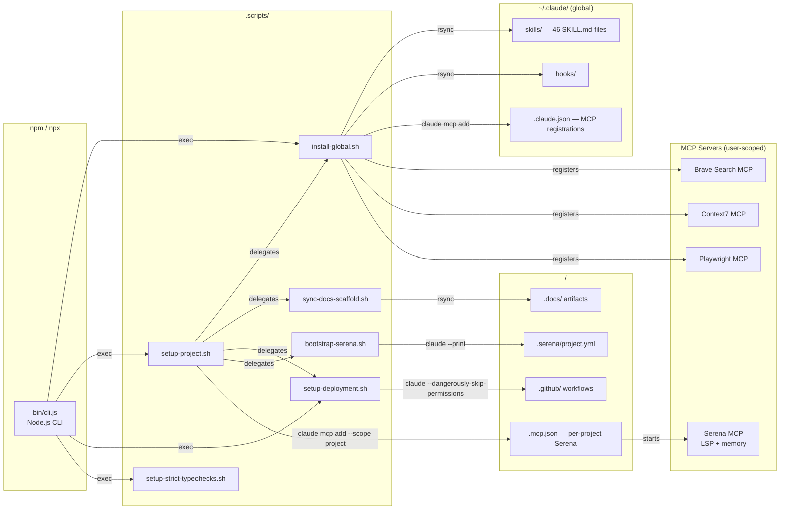
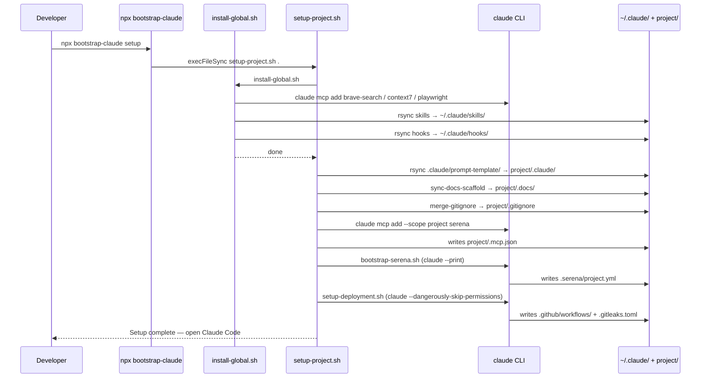

# bootstrap-claude

Bootstrap new Claude Code projects with reusable slash commands, MCP server setup, structured task management, and a UAT testing system — all deployable via a single shell script or `npx` command.

**Repository:** https://github.com/codewizard-dt/basic-project-setup

## Description

`bootstrap-claude` is a project setup template and npm-distributed CLI tool that scaffolds a Claude Code workspace with everything needed for structured, AI-assisted development workflows. It installs and configures four MCP servers (Serena for semantic code intelligence, Brave Search for web research, Context7 for library documentation, and Playwright for browser automation), copies a library of 46 custom skills into the global `~/.claude/skills/` directory, and establishes a task management, UAT, and Architecture Decision Record (ADR) system under `.docs/`.

The template was built to solve a recurring pain point: every new Claude Code project requires the same tedious setup — adding MCP servers, creating task directories, defining documentation conventions, and writing skill workflows. With `bootstrap-claude`, that entire setup happens in a single `npx bootstrap-claude setup` run, including interactive API key prompts and idempotent installation checks that skip already-configured servers. It implements a full spec-driven development pipeline: Product Requirements Documents (PRDs) upstream of Architecture Decision Records (ADRs) upstream of execution tasks, with bidirectional cross-linking and immutability rules at each layer.

It is designed for developers who treat AI agents as first-class collaborators. The slash commands, task file format, and UAT system are all engineered to give Claude (and other agents) clear, unambiguous instructions — enabling reliable delegation of planning, implementation, testing, and documentation tasks. The full workflow spans requirements capture (`/prd-create`), architectural decisions (`/adr-create`), task creation (`/task-add`), implementation delegation (`/tackle`, `/now`), test generation (`/uat-generate`), interactive walkthrough (`/uat-walk`), and documentation updates (`/update-docs`).

## Architecture

### Overview

`bootstrap-claude` is a **template-plus-CLI** project: a thin Node.js CLI wrapper (`bin/cli.js`) distributes a collection of Bash scripts, markdown skill specs, and `.docs/` scaffold via npm. There is no server, database, or runtime dependency beyond `node`, `bash`, `claude` CLI, and `uv`. The primary artifacts are the 46 `SKILL.md` files under `.claude/skills/` — each is a self-contained workflow specification that Claude Code loads as custom slash commands — and the four Bash setup scripts that install MCP servers and sync those skills globally. The whole system is stateless from the template's perspective: state lives in the target project's `.docs/` directory, not in this package.

### Components

#### CLI Entry Point (`bin/cli.js`)

- **Responsibility:** Dispatch `npx bootstrap-claude <command>` to the appropriate Bash script.
- **Tech:** Node.js (CommonJS), `child_process.execFileSync`
- **Inputs:** CLI args (`setup`, `update`, `install`, `deployment`, `typechecks`)
- **Outputs:** Delegates to a Bash script via stdio inheritance; exits with the script's exit code
- **Depends on:** `.scripts/` directory (sibling on disk)

#### Global Install Script (`.scripts/install-global.sh`)

- **Responsibility:** Idempotently install four MCP servers at `--scope user` and rsync all 46 skills + hooks to `~/.claude/`.
- **Tech:** Bash (`set -euo pipefail`), `claude mcp add`, rsync
- **Inputs:** Environment variables `BRAVE_API_KEY`, `CONTEXT7_API_KEY` (interactive prompts as fallback)
- **Outputs:** Populated `~/.claude/skills/`, `~/.claude/hooks/`; four MCP entries in `~/.claude.json`
- **Depends on:** `claude` CLI, `npx`, internet access for MCP package installs

#### Project Setup Script (`.scripts/setup-project.sh`)

- **Responsibility:** Bootstrap a new project — run the global install, copy `.claude/prompt-template/`, sync the `.docs/` scaffold, merge `.gitignore`, scaffold CI/CD, and register Serena per-project.
- **Tech:** Bash, rsync, `claude mcp add --scope project`
- **Inputs:** Target project directory path
- **Outputs:** Populated `<project>/.docs/`, `<project>/.mcp.json`, `<project>/.github/` workflows, `<project>/.gitleaks.toml`
- **Depends on:** `install-global.sh`, `sync-docs-scaffold.sh`, `merge-gitignore.sh`, `setup-deployment.sh`, `bootstrap-serena.sh`, `uv`

#### CI/CD Scaffolding Script (`.scripts/setup-deployment.sh`)

- **Responsibility:** Copy-once CI scaffold (GitHub Actions workflows, `.gitleaks.toml`) into a target project by running a Claude prompt.
- **Tech:** Bash, `claude --dangerously-skip-permissions`, prompt template injection
- **Inputs:** `.claude/prompt-template/setup-deployment.md` (template), `.docs/guides/deployment-strategy.md` (guide), target project path
- **Outputs:** `<project>/.github/workflows/security.yml` (always overwritten), `<project>/.github/workflows/build.yml` (created once), `<project>/.gitleaks.toml` (created once)
- **Depends on:** `claude` CLI (invoked headlessly), target project directory

#### Docs Scaffold Sync (`.scripts/sync-docs-scaffold.sh`)

- **Responsibility:** Sync the `.docs/` directory skeleton (guides, `.gitkeep` files, READMEs) into a target project without overwriting project content.
- **Tech:** Bash, rsync (`--ignore-existing`)
- **Inputs:** Target project directory
- **Outputs:** `<project>/.docs/` with guides and empty folder shells
- **Depends on:** rsync

#### Serena Bootstrap (`.scripts/bootstrap-serena.sh`)

- **Responsibility:** Headlessly create `.serena/project.yml` and enable the 11 optional Serena tools for the target project.
- **Tech:** Bash, `claude --print` (headless mode)
- **Inputs:** Target project directory
- **Outputs:** `<project>/.serena/project.yml`
- **Depends on:** `claude` CLI, Serena MCP registered for the project

#### Skills Library (`.claude/skills/`)

- **Responsibility:** 46 self-contained workflow specs (SKILL.md files) that Claude Code loads as custom slash commands. Each spec defines required MCP tools, step-by-step logic, output formats, and integration contracts with the `.docs/` artifact system.
- **Tech:** Markdown (Claude Code Skills directory format)
- **Inputs:** User invocation via `/skill-name` in Claude Code
- **Outputs:** Files created/updated in `.docs/` (tasks, UAT, PRDs, ADRs, roadmaps, bugs), git commits, MCP tool calls
- **Depends on:** Serena MCP, Brave Search MCP, Context7 MCP, Playwright MCP (per-skill requirements)

#### Docs Artifact System (`.docs/`)

- **Responsibility:** Persistent, structured home for all project artifacts: PRDs, ADRs, tasks, UAT files, roadmaps, bugs, guides, and company context. Each artifact type has its own lifecycle with folder-move semantics (e.g., `tasks/active/` → `tasks/completed/`).
- **Tech:** Markdown (frontmatter-structured files), `.gitkeep` directory shells
- **Inputs:** Written and updated by skills
- **Outputs:** Cross-linked artifact files consumed by subsequent skills and agents
- **Depends on:** (none — pure filesystem artifacts)

### Component Interaction



### Data Flow



### Design Decisions

- **Skills installed globally, not per-project** — skills are rsync'd to `~/.claude/skills/` so every Claude Code project on the machine benefits automatically; individual projects carry no skill files.
- **Serena registered per-project with an absolute path** — prevents language server config bleed across projects (each Serena instance is isolated to its own directory).
- **`setup-deployment.sh` never called by `update-project.sh`** — CI/CD workflows get hand-customized per project and must not be clobbered on template updates; the seam is explicit and deliberate.
- **Headless Claude invocation for scaffolding** — `claude --dangerously-skip-permissions` and `claude --print` are used for Serena bootstrap and CI scaffold so the setup scripts are fully non-interactive after the initial API key prompts.
- **Copy-once semantics for CI files** — `security.yml` is always overwritten (generic, project-agnostic); `build.yml` and `.gitleaks.toml` are created once and then left alone, preserving project-specific customizations.
- **`build.yml` is disabled by default via a commented-out `push:` trigger** — the workflow ships with only `workflow_dispatch:` active, so it never fires automatically on push. Enable automatic deploys by uncommenting the `push: branches: [main]` lines in the `on:` block. This is explicit opt-in regardless of what files exist in the project.

## Technologies

**Runtime & Language**
- Node.js (CommonJS, `child_process`)
- Bash / Zsh (strict mode: `set -euo pipefail`)
- Markdown (skill specs, task files, ADRs, UAT files, guides)

**Package Management & Distribution**
- npm / npx (`@codewizard-dt/bootstrap`, bin: `bootstrap`)
- uv (Astral Python package manager, required for Serena MCP)

**MCP Servers (Model Context Protocol)**
- Serena MCP — LSP-powered semantic code exploration, symbolic editing, and persistent project memory
- Brave Search MCP (`@modelcontextprotocol/server-brave-search`) — web research with rate limiting
- Context7 MCP (HTTP transport) — library and framework documentation lookups
- Playwright MCP (`@playwright/mcp`) — browser automation and screenshot capture for UI testing

**Tooling & Infrastructure**
- Claude Code CLI (`claude`) — AI coding assistant with custom slash command support
- Git + GitHub — version control, remote hosting, and CI/CD via GitHub Actions
- GitHub Actions — Gitleaks secret scanning (`security.yml`), Docker build/push/deploy (`build.yml`)
- Gitleaks — secret scanning on every push and PR
- rsync — non-destructive, idempotent directory syncing for template updates

## Use Cases

- **Bootstrapping new Claude Code projects** — run once to install MCP servers, copy all 46 skills globally, and scaffold the task, UAT, and documentation directory structure into any project root.
- **Structured AI-agent delegation** — use the task file format and custom commands (`/tackle`, `/now`) to delegate multi-step implementation work to Claude with clear, machine-readable instructions and agent-type annotations per step.
- **Feature validation via UAT** — generate acceptance tests with `/uat-generate` and validate them interactively with `/uat-walk` or headlessly with `/uat-auto` (fail-closed auto-judging for orchestrator-dispatched runs), including automatic API test execution and Playwright-assisted UI diagnosis.
- **Product Requirements Documents (PRDs)** — capture *what to build and why* with `/prd-create` (Socratic Q&A elicitation), approve them with `/prd-finalize` (completeness audit), and translate requirements into architectural decisions with `/prd-extract-decisions`. The PRD layer enforces named personas, measurable success metrics, and explicit non-goals before any code decisions are made.
- **Architecture Decision Records (ADRs)** — capture significant decisions with `/adr-create`, ratify them per-decision with `/adr-finalize`. Each ADR file is a Decision Group of 1+ independently versioned decisions (`ADR-NNNN#DM`); supersession is atomic across the two affected decision blocks, the index, and a mermaid relationship graph, while sibling decisions in the same file evolve independently.
- **Knowledge-preserving development** — Serena's memory system persists architectural decisions, gotchas, and integration patterns across sessions, so agents don't repeat mistakes or lose context between conversations.
- **Template synchronization** — run `npx bootstrap-claude update` on existing projects to pull in the latest skill and `.docs/` scaffold improvements without overwriting project-specific files. Run `npx bootstrap-claude deployment` to opt an existing project into CI/CD by scaffolding `.github/` workflows.

## Skills Demonstrated

- **CLI Tool Development (Node.js)** — Authored an npm-distributed CLI that wraps shell scripts with argument dispatch, path resolution, and cross-platform child process execution via `execFileSync`.
- **Bash Scripting & Shell Automation** — Wrote idempotent setup scripts with strict error handling (`set -euo pipefail`), interactive API key prompts, environment variable fallbacks, graceful dependency checks, and orphan-cleanup detection for renamed artifacts.
- **AI Agent Workflow Design** — Designed a complete AI-assisted development loop: requirements capture → architectural decisions → task creation → implementation delegation → UAT generation → interactive walkthrough → completion tracking, with agent-type annotations for subagent dispatch.
- **Model Context Protocol (MCP) Integration** — Orchestrated four MCP servers across global and per-project scopes, enforcing mandatory tool-usage patterns and preventing suboptimal fallbacks via a comprehensive MCP tools reference guide.
- **Technical Documentation & Specification Writing** — Produced thousands of lines of precise, machine-readable command specifications covering tool requirements, step logic, error handling, and output formats across 46 custom slash commands.
- **Spec-Driven Development Pipeline Design** — Implemented a full requirements → decisions → implementation pipeline: PRDs (what & why) → ADRs (how & why) → tasks (what changes), with bidirectional cross-linking and immutability enforced at each layer.
- **Architecture Decision Record (ADR) System Design** — Built a multi-decision-per-file ADR framework on top of MADR 4.0 + Nygard, with per-decision identifiers (`ADR-NNNN#DM`), E-C-A-D-R Definition of Done, atomic two-block supersession, and a mermaid-rendered relationship graph kept in sync across the index.
- **Task Lifecycle Management** — Designed and implemented a three-stage task management system (`active → completed → trashed`) with structured frontmatter, cross-linked UAT references, dependency blocks, and agent-executable step definitions.
- **User Acceptance Testing (UAT) Framework Design** — Built a custom UAT system supporting API auto-execution, batched UI testing, Playwright-assisted visual diagnosis, per-test pass/fail/fix workflows, and parallel pending/completed/skipped/trashed tracking.
- **npm Package Authoring & Distribution** — Configured `package.json` with `bin`, `files`, and repository fields; packaged and published to the npm registry under a scoped namespace (`@codewizard-dt/bootstrap`).
- **Knowledge Management System Design** — Structured Serena memory hierarchies (topic `/` subtopic convention) for persistent, session-spanning project knowledge retrieval with topic-filtered recall across dozens of projects.
- **Template & Scaffolding System Architecture** — Designed a reusable, rsync-based template distribution system that supports both initial setup and incremental updates without destructive overwrites, including a deliberate CI/CD seam that is called once on setup and never on update.

## Deployment

### Overview

`bootstrap-claude` is an npm package published to the registry under `@codewizard-dt/bootstrap`. There is no server to deploy — the package is a CLI + file collection. "Deployment" means publishing a new version to npm. CI/CD is managed via two GitHub Actions workflows in `.github/workflows/`.

### Prerequisites

- `node >= 18` and `npm`
- npm account with publish access to the `@codewizard-dt` scope
- `npm login` completed (or `NPM_TOKEN` set as a GitHub Actions secret for automated publish)
- Git remote set to `https://github.com/codewizard-dt/basic-project-setup`

### Environment Variables

No runtime environment variables are required by the package itself. The setup scripts prompt for these when running in a target project:

| Variable | Required | Example | Description |
|---|---|---|---|
| `BRAVE_API_KEY` | yes (for Brave MCP) | `BSAa...` | Brave Search API key; prompted interactively if absent |
| `CONTEXT7_API_KEY` | optional | `ctx7-...` | Context7 API key; skipped if blank (anonymous access) |

### Build

No build step is required — the package ships source files directly (JS and Bash are interpreted). Verify the `files` field in `package.json` includes all files you intend to publish, then pack to inspect:

```bash
npm pack --dry-run
```

### Run Locally

To test the CLI locally without publishing:

```bash
# From the repo root — link the package globally
npm link

# Then in any target project directory
bootstrap setup
bootstrap update
bootstrap install
```

### Deploy

Publishing a new version to npm:

1. Bump the version in `package.json`:
   ```bash
   npm version patch   # or minor / major
   ```
2. Publish to the registry:
   ```bash
   npm publish --access public
   ```
3. Push the version tag to GitHub:
   ```bash
   git push && git push --tags
   ```

There is no automated publish workflow configured. Publishes are manual.

**Enabling the Docker build/deploy workflow (`build.yml`):**

`build.yml` is scaffolded but **disabled by default** — the `push:` trigger is commented out, so the workflow only runs when manually dispatched from the Actions tab. To enable automatic deploys:

1. In `.github/workflows/build.yml`, uncomment the `push:` block under `on:`.
2. Configure the `deploy` job — choose self-hosted runner (Option A) or GitHub-hosted + SSH (Option B) per the inline TODO comments in `build.yml`.
3. Push to `main` — the build and deploy jobs now run automatically.

### Data & Migrations

Not applicable — the package has no database or schema.

If you rename or remove a skill directory, add its old name to the `ORPHAN_SKILLS` array in `.scripts/install-global.sh` so existing installations are prompted to clean up the stale folder.

### Health Checks & Smoke Tests

After publishing, verify the package installs and dispatches correctly:

```bash
# Install from registry in a temp directory
mkdir /tmp/test-bootstrap && cd /tmp/test-bootstrap
npm init -y
npx @codewizard-dt/bootstrap setup .
```

Expected: the setup script runs, MCP servers are installed, and `.docs/` scaffold is created.

### Rollback

npm does not allow re-publishing the same version. To roll back:

1. Deprecate the bad version:
   ```bash
   npm deprecate @codewizard-dt/bootstrap@<bad-version> "Broken — use <prev-version>"
   ```
2. Users pin to the previous version explicitly:
   ```bash
   npx @codewizard-dt/bootstrap@<prev-version> setup
   ```

### Observability

No server-side observability. Download stats and version history are visible at `https://www.npmjs.com/package/@codewizard-dt/bootstrap`.

CI security scanning runs on every push and PR via the Gitleaks GitHub Actions workflow (`.github/workflows/security.yml`). Results appear in the GitHub Actions tab under "Security" workflow runs.

### Troubleshooting

- **`bootstrap: command not found` after `npm link`** — run `npm link` again from the repo root; check that `~/.npm-global/bin` is on your `PATH`.
- **`Error: 'claude' is not installed`** — install Claude Code: `npm install -g @anthropic-ai/claude-code`.
- **`Error: 'uv' is not installed`** — install uv: `curl -LsSf https://astral.sh/uv/install.sh | sh`.
- **Serena already registered but wrong path** — remove and re-add: `claude mcp remove serena -s project && npx @codewizard-dt/bootstrap setup .`
- **Skills not appearing in Claude Code** — check `~/.claude/skills/` is populated; run `npx @codewizard-dt/bootstrap install` to re-sync.
- **`security.yml` Gitleaks scan failing** — ensure `.gitleaks.toml` exists in the project root; run `npx @codewizard-dt/bootstrap deployment .` to scaffold it.
