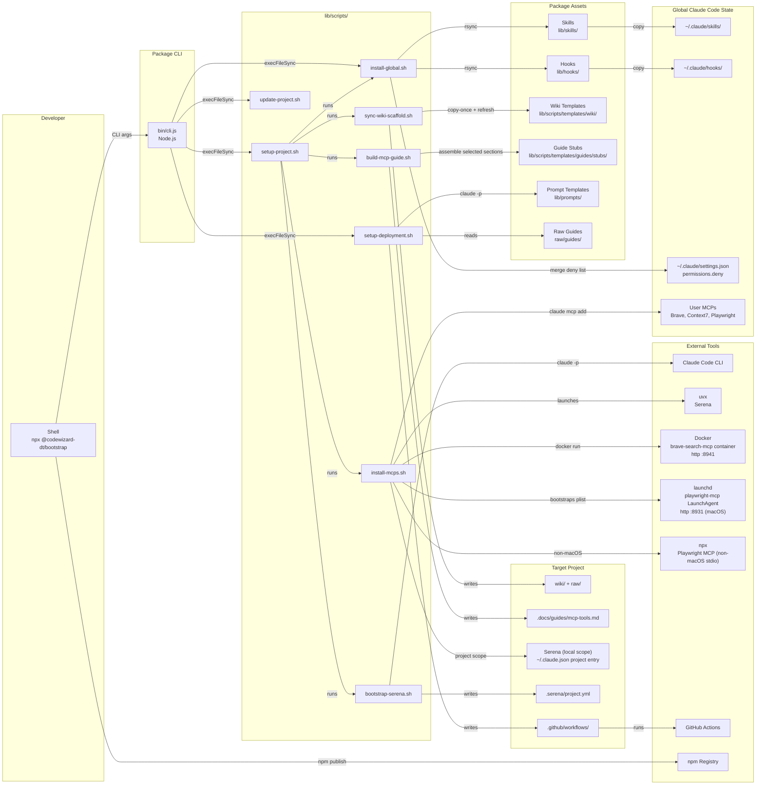
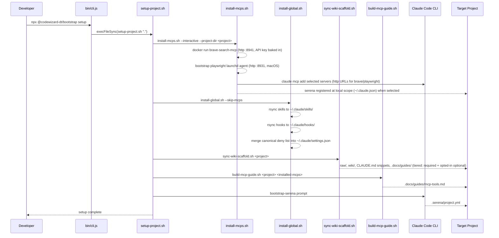
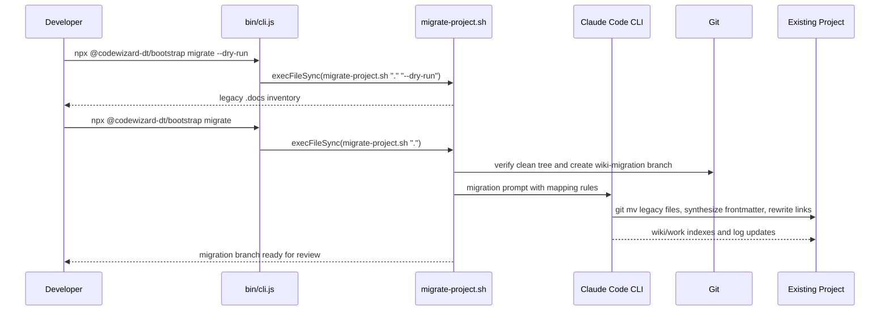

# @codewizard-dt/bootstrap

Bootstrap Claude Code projects with an LLM Wiki, reusable skills, enforcement hooks, MCP setup, and project scaffolding from one npm CLI.

**Repository:** https://github.com/codewizard-dt/bootstrap-claude

## Description

`@codewizard-dt/bootstrap` is an npm-distributed setup toolkit for Claude Code users who repeatedly configure the same agent workflow in new repositories. It installs Model Context Protocol servers, syncs a global skill library, copies hook scripts, scaffolds an LLM Wiki, assembles a project-specific MCP tools guide, and provides explicit commands for CI/CD and strict type-checking setup.

The project exists to move AI-agent state out of chat history and into structured, versioned markdown. Requirements, decisions, tasks, UAT specs, bug reports, roadmaps, source summaries, and operating logs all live in a predictable wiki layout, so future Claude Code sessions and subagents can resume work from file-system state instead of relying on prior conversation context.

The package is aimed at developers and teams using Claude Code as a daily engineering assistant. It provides a reusable operating system for AI-assisted software work: durable knowledge, lifecycle-managed work artifacts, slash-command skills, LSP-first code navigation rules, and safety hooks that keep agent behavior consistent across projects.

## Architecture

### Overview

`@codewizard-dt/bootstrap` is a CLI-plus-template package, not a long-running service. The Node.js CLI in `bin/cli.js` dispatches commands to Bash orchestration scripts, and those scripts install global assets, scaffold project-local files, register MCP servers, and invoke the Claude Code CLI for context-sensitive setup. Most state is written into the target project as markdown, JSON, YAML, and shell-generated scaffolding; the package itself remains stateless between invocations.

At a glance, the package entry point selects a script, scripts copy or generate assets, assets become global Claude Code skills/hooks or project-local wiki files, and Claude Code plus MCP servers provide the runtime behavior in the consumer project.

### Components

#### CLI Entry Point

- **Responsibility:** Routes `bootstrap <command>` and `npx @codewizard-dt/bootstrap <command>` invocations to the appropriate setup script.
- **Tech:** Node.js CommonJS, `child_process.execFileSync`
- **Inputs:** Commands such as `setup`, `update`, `install`, `deploy`, `migrate`, `typechecks`, and `dashboard`, plus optional extra arguments for deploy, migration, and dashboard (port override) flows.
- **Outputs:** Executes the selected script with inherited stdio and propagates the script exit status.
- **Depends on:** Setup Scripts

#### Setup Scripts

- **Responsibility:** Coordinate project setup, updates, global installs, explicit deployment scaffolding, Serena bootstrapping, wiki migration, and strict type-checking setup.
- **Tech:** Bash, `rsync`, `find`, `grep`, `claude` CLI, npm-executed shell scripts
- **Inputs:** Target project path, interactive prompts, CLI flags such as `--dry-run`, API keys supplied by environment variables or stdin, and optional user context for deploy/typecheck setup.
- **Outputs:** Global hooks and skills, MCP registrations, project-local `wiki/`, `raw/`, `.docs/guides/`, `.mcp.json`, `.serena/project.yml`, and optional deployment or type-check configuration when those explicit commands are run.
- **Depends on:** CLI Entry Point, Skills Library, Hooks Library, Wiki Scaffold Templates, Prompt Templates, Guide Stubs, Claude Code CLI, MCP servers

#### MCP Installer

- **Responsibility:** Registers Serena, Brave Search, Context7, and Playwright MCP servers with the correct user or project scope.
- **Tech:** Bash, `claude mcp add`, `uvx`, `npx`, Docker (shared `brave-search-mcp` container), launchd (macOS Playwright LaunchAgent)
- **Inputs:** `--interactive`, `--project-dir`, `BRAVE_API_KEY`, optional `CONTEXT7_API_KEY`, and scope choices from interactive prompts.
- **Outputs:** User-scope MCP registrations for shared tools and project-scope `.mcp.json` registration for Serena when selected.
- **Depends on:** Claude Code CLI, uv/uvx, npm package execution

#### Skills Library

- **Responsibility:** Provides reusable Claude Code skills for requirements, decisions, tasks, UAT, bugs, roadmaps, research, docs, linting, evals, security audits, flashcards, demos, and other agent workflows.
- **Tech:** Markdown `SKILL.md` files in `lib/skills/`
- **Inputs:** User-invoked skill names in Claude Code sessions, file paths, task descriptions, requirements, and project context.
- **Outputs:** Structured agent behavior, wiki work items, generated reports, UAT specs, documentation updates, and guided workflow transitions.
- **Depends on:** Target project files, MCP guide rules, installed MCP servers where applicable

#### Hooks Library

- **Responsibility:** Enforces safety and Serena-first code navigation policies across Claude Code sessions, including sessions running with permissive tool modes.
- **Tech:** Node.js hook scripts in `lib/hooks/`, shared helper modules in `lib/hooks/lib/`
- **Inputs:** Claude Code PreToolUse, PostToolUse, and SessionStart hook payloads for tools such as Read, Write, Edit, Bash, Grep, Glob, and Agent.
- **Outputs:** Pass-through decisions, block messages, Serena-equivalent suggestions, and navigation state files under `~/.claude/state/`.
- **Depends on:** Claude Code hook registration, `.serena/project.yml`, global `~/.claude/hooks/` installation

#### Wiki Scaffold Templates

- **Responsibility:** Defines the LLM Wiki directory structure, conventions, lifecycle specs, indexes, archive folders, and Claude guidance installed into target projects.
- **Tech:** Markdown templates under `lib/scripts/templates/wiki/`, `CLAUDE.md` snippets, `.gitkeep` files
- **Inputs:** Target project path and `sync-wiki-scaffold.sh` copy policy.
- **Outputs:** `raw/`, `wiki/knowledge/`, `wiki/work/`, lifecycle files, family indexes, archive directories, `wiki/conventions.md`, `wiki/log.md`, and target-project `CLAUDE.md` additions.
- **Depends on:** Setup Scripts

#### Guide Stubs

- **Responsibility:** Builds `.docs/guides/mcp-tools.md` from only the MCP sections that apply to the target project.
- **Tech:** Markdown fragments in `lib/scripts/templates/guides/stubs/`, Bash assembly in `build-mcp-guide.sh`
- **Inputs:** Target project path and installed MCP server names.
- **Outputs:** A tailored MCP tools guide in the target project's `.docs/guides/` directory.
- **Depends on:** MCP Installer, Setup Scripts

#### Prompt Templates

- **Responsibility:** Provide Claude Code with structured instructions for CI/CD setup, wiki migration, Serena configuration, and strict type-checking setup when static templates are too brittle.
- **Tech:** Markdown prompt files in `lib/prompts/`
- **Inputs:** Target project context, raw guide content, script interpolation, and optional user-provided deployment/typecheck details.
- **Outputs:** Claude-generated project configuration, workflow files, migrated wiki artifacts, and type-check tooling.
- **Depends on:** Claude Code CLI, raw guides, Setup Scripts

#### GitHub Actions Templates

- **Responsibility:** Supplies repository automation for secret scanning and a Docker/GHCR build-push template.
- **Tech:** GitHub Actions YAML, Gitleaks action, Docker Buildx actions
- **Inputs:** Pushes and pull requests to `main` for `security.yml`; manual `workflow_dispatch` for `build.yml`; root-level `Dockerfile` for container build execution.
- **Outputs:** Gitleaks scan results, optional GHCR container images, and a placeholder deploy job that must be customized before production use.
- **Depends on:** GitHub Actions, `.gitleaks.toml`, GitHub package permissions

### Component Interaction



### Data Flow





### Design Decisions

- **CLI dispatch stays thin:** `bin/cli.js` only maps command names to scripts, leaving workflow logic in Bash where filesystem setup and command orchestration are easier to inspect and run directly.
- **Global skills and hooks, project-local wiki:** Shared agent behavior is installed once under `~/.claude/`, while project knowledge and work state remain versioned inside each repository.
- **Project-scoped Serena:** Serena is registered against an absolute project path in `.mcp.json`, avoiding cross-project language-server bleed while keeping other MCPs available globally when appropriate.
- **Copy-once vs. always-refresh templates:** Project-owned files such as indexes and logs are not overwritten, while lifecycle specs, conventions, and guide content can be refreshed from the package.
- **Hooks enforce behavior where permissions cannot:** PreToolUse and PostToolUse hooks enforce `.env` safety, protected git operations, and Serena-first navigation even when normal allow/deny permissions are bypassed.
- **Claude-driven scaffolding handles project variance:** Deployment, type-checking, Serena configuration, and wiki migration use prompt templates plus `claude -p` because the right output depends on the consumer project's stack.

## Technologies

- **Languages and runtimes**
  - Node.js CommonJS for the CLI and hook scripts
  - Bash for installation, synchronization, migration, and setup orchestration
  - Markdown for skills, prompts, wiki templates, raw guides, and project documentation
  - YAML for GitHub Actions workflows and generated Serena/project configuration
  - JSON for `package.json`, `.mcp.json`, hook payloads, and Claude Code settings snippets

- **CLI and package distribution**
  - npm package distribution with the scoped package name `@codewizard-dt/bootstrap`
  - `npx` execution for one-command setup
  - `package.json` `bin` mapping to expose the `bootstrap` command

- **Automation and scripting**
  - `rsync` for idempotent global asset installation and scaffold synchronization
  - Git for migration preflights, branches, and history-preserving moves
  - Shell utilities used by scripts for path resolution, file detection, and template assembly

- **AI and MCP tooling**
  - Claude Code CLI for MCP registration and prompt-driven scaffolding
  - Model Context Protocol (MCP)
  - Serena MCP for LSP-backed code exploration and editing
  - Brave Search MCP for web research
  - Context7 MCP for library documentation lookup
  - Playwright MCP for browser automation and UI inspection
  - uv/uvx for launching Serena from its GitHub source

- **Workflow assets**
  - Claude Code skills system using `SKILL.md`
  - Claude Code hooks using PreToolUse, PostToolUse, and SessionStart events
  - LLM Wiki structure with `raw/`, `wiki/knowledge/`, and `wiki/work/`
  - Mermaid diagrams embedded in documentation

- **CI/CD and security**
  - GitHub Actions
  - Gitleaks and `.gitleaks.toml`
  - Docker Buildx GitHub Actions template
  - GitHub Container Registry template workflow

## Use Cases

- **New Claude Code project bootstrap:** Developers can run one command in a repository to install MCP tooling, global skills, global hooks, wiki scaffolding, MCP guides, and Serena configuration, then run deployment scaffolding separately when needed.
- **Global agent workflow installation:** Users can sync the latest skill and hook library into `~/.claude/` without modifying any project by running the install command.
- **Legacy documentation migration:** Existing `.docs/`-style projects can be migrated into the current LLM Wiki structure with branch isolation, path mapping, frontmatter synthesis, and link rewrites.
- **AI-native engineering operations:** Teams can manage requirements, decisions, tasks, UAT, roadmaps, bugs, evals, research, demos, and security audits as durable markdown artifacts that agents can read and update.
- **Safer code-agent behavior:** Serena-first hooks, `.env` guards, and protected git operation blocks reduce fragile file access patterns and prevent common agent mistakes across normal and permissive sessions.

## Skills Demonstrated

- **CLI Tool Development (Node.js):** Built an npm-executable CLI with command routing, argument forwarding, inherited stdio, clear usage output, and process exit-code propagation.
- **Shell Scripting and Idempotent Automation (Bash, rsync):** Implemented repeatable setup scripts with preflight checks, copy-once vs. refresh semantics, interactive and non-interactive modes, and safe global installation behavior.
- **AI-Native Workflow System Design:** Designed a structured markdown workflow for requirements, decisions, tasks, roadmaps, bugs, UAT, research, evals, and documentation that can be resumed by independent agent sessions.
- **Knowledge Management Architecture (LLM Wiki):** Modeled project memory as immutable raw sources, timeless knowledge synthesis, and lifecycle-managed work artifacts with conventions, indexes, logs, stable IDs, and typed links.
- **Model Context Protocol Integration:** Integrated Serena, Brave Search, Context7, and Playwright MCP servers with appropriate scope decisions, API-key handling, and generated MCP usage guidance.
- **Claude Code Hook Engineering (Node.js):** Built hook scripts that enforce file-safety and LSP-first navigation policies using Claude Code hook payloads, shared helper modules, and persistent navigation state.
- **Prompt Engineering for Developer Tooling:** Created prompt templates that let Claude Code generate context-sensitive deployment, migration, type-checking, and Serena configuration changes in consumer projects.
- **CI/CD Pipeline Configuration (GitHub Actions):** Provided security scanning and container build/push workflow templates using Gitleaks, Docker Buildx, GHCR, manual dispatch, and skip guards for repositories without Dockerfiles.
- **Developer Experience Design:** Organized commands, skills, templates, guides, and troubleshooting paths so repeated Claude Code setup work can be performed from a small set of predictable commands.
- **Documentation Systems Engineering:** Generated machine-parseable project documentation, skill instructions, lifecycle specs, MCP guides, and runbooks that serve both humans and downstream AI tools.

## Deployment

### Overview

This project deploys as a public npm CLI package. There is no hosted runtime, database, or production server; publishing a new npm version is the release process, while GitHub Actions provides repository security scanning and an optional manual container-build template.

### Prerequisites

- `node >= 18` for local CLI execution and npm packaging.
- `npm` with publish access to the `@codewizard-dt` scope.
- An authenticated npm session via `npm login` or an npm automation token.
- Git access to the repository at `git@github.com:codewizard-dt/bootstrap-claude.git`.
- GitHub Actions enabled for repository CI checks.
- For local smoke tests of setup commands, install Claude Code with `npm install -g @anthropic-ai/claude-code`.
- For Serena setup smoke tests, install `uv` so `uvx` is available.

### Environment Variables

No environment variables are required to build or publish this package from a logged-in npm session. The setup scripts and generated workflows reference the following variables and secrets:

| Variable | Required | Example | Description |
|---|---|---|---|
| `BRAVE_API_KEY` | yes for non-interactive Brave MCP install | `BSA...` | Secret baked into the `brave-search-mcp` Docker container's environment at creation (it stays out of `~/.claude.json`); prompted interactively if absent. To rotate: `docker rm -f brave-search-mcp`, then re-run `bootstrap update` with the new key. |
| `BRAVE_MCP_PORT` | no — defaults to `8941` | `8941` | Host port for the shared Brave Search MCP Docker container (mapped to the container's fixed port `8941`); the registered endpoint is `http://127.0.0.1:<port>/mcp`. |
| `PLAYWRIGHT_MCP_PORT` | no — defaults to `8931` | `8931` | Port the shared Playwright MCP launchd agent listens on (macOS); the registered endpoint is `http://127.0.0.1:<port>/mcp`. |
| `CONTEXT7_API_KEY` | optional for Context7 MCP install | `ctx_...` | Optional secret sent as a Context7 MCP HTTP header; Context7 can be installed without it. |
| `GITHUB_TOKEN` | yes in GitHub Actions | `${{ secrets.GITHUB_TOKEN }}` | GitHub-provided token used by Gitleaks and GHCR login in workflows. |
| `FORCE_JAVASCRIPT_ACTIONS_TO_NODE24` | yes in workflows | `true` | Plain workflow config forcing JavaScript actions to run on Node 24. |
| `REGISTRY` | yes in `build.yml` | `ghcr.io` | Plain workflow config for the container registry in the template workflow. |
| `OWNER` | yes in `build.yml` | `${{ github.repository_owner }}` | Plain workflow config used to build GHCR image tags. |
| `IMAGE` | yes in `build.yml` | `${{ github.event.repository.name }}` | Plain workflow config used to build GHCR image tags. |
| `CLAUDE_MIGRATION` | optional | `1` | Plain flag recognized by some Serena enforcement hooks to bypass during migration flows. |

### Build

There is no transpilation or bundling step. The package ships source files directly through the `files` list in `package.json`.

```bash
# Inspect the package contents before publishing
npm pack --dry-run
```

The publishable surface is `bin/`, `lib/`, `raw/`, `.github/`, and `.gitleaks.toml`.

### Run Locally

```bash
# Show CLI usage without making project changes
node bin/cli.js

# Install global MCPs, hooks, and skills
node bin/cli.js install

# Run setup against the current repository
node bin/cli.js setup

# Launch the live wiki/work dashboard for the current repository (Ctrl-C to stop)
# Serves on http://localhost:4317 by default; pass a port to override
node bin/cli.js dashboard
node bin/cli.js dashboard 4400

# Preview deployment-scaffold detection for the current repository
node lib/scripts/setup-deployment.sh --dry-run .
```

The setup command writes to the current project and to `~/.claude/`, so run it from a disposable test repository when validating a release candidate.

### Deploy

1. Confirm the working tree contains only the intended release changes.

```bash
git status --short
```

2. Preview the package contents.

```bash
npm pack --dry-run
```

3. Bump the npm version.

```bash
npm version patch
# or: npm version minor
# or: npm version major
```

4. Publish the package.

```bash
npm publish --access public
```

5. Verify the published version.

```bash
npm view @codewizard-dt/bootstrap version
npx @codewizard-dt/bootstrap@latest
```

CI/CD details:

- `.github/workflows/security.yml` runs Gitleaks on pushes and pull requests targeting `main`.
- `.github/workflows/build.yml` is manual-only via `workflow_dispatch`; its build job skips unless a root-level `Dockerfile` exists, and its deploy job is a placeholder.
- No workflow currently publishes the npm package automatically; npm release is manual.

### Data & Migrations

This package has no database, schema migrations, object storage, queues, or runtime persistence. Data migration support in this repo refers to consumer-project documentation migration through `npx @codewizard-dt/bootstrap migrate`, which creates a reviewable `wiki-migration` branch and moves legacy `.docs/` artifacts into the LLM Wiki structure.

### Health Checks & Smoke Tests

There is no HTTP health endpoint because this is a CLI package. Use command-level smoke tests:

```bash
# Local CLI usage should print command help and exit nonzero
node bin/cli.js

# Package metadata should resolve from npm after publish
npm view @codewizard-dt/bootstrap version

# The latest package should execute and print usage without a command
npx @codewizard-dt/bootstrap@latest

# Security workflow should pass in GitHub Actions
gh run list --workflow security.yml --limit 5
```

For end-to-end validation, run `npx @codewizard-dt/bootstrap@latest setup` inside a disposable repository and confirm `wiki/`, `raw/`, `.docs/guides/`, and the selected MCP configuration files are created.

### Rollback

If a release is bad, prefer deprecating the broken npm version and publishing a fixed version:

```bash
npm deprecate @codewizard-dt/bootstrap@<bad-version> "Contains a release issue; upgrade to <fixed-version>."
npm version patch
npm publish --access public
```

If the package version qualifies for npm unpublish rules and removal is necessary:

```bash
npm unpublish @codewizard-dt/bootstrap@<bad-version>
```

For source rollback, revert the release commit and publish a new patch version rather than rewriting repository history.

### Observability

There is no runtime telemetry, metrics backend, dashboard, or alerting because the project is a CLI package. Operational signals come from GitHub Actions logs, npm package metadata, npm install/publish output, and user-reported command failures.

Useful first places to inspect:

- GitHub Actions security workflow runs in `.github/workflows/security.yml`.
- Manual build template runs in `.github/workflows/build.yml`.
- npm package metadata from `npm view @codewizard-dt/bootstrap`.
- Local command traces from the setup scripts' stdout/stderr.

### Troubleshooting

- **`command not found: bootstrap`:** The package binary is not on PATH; run through `npx @codewizard-dt/bootstrap <command>` or use `node bin/cli.js <command>` locally.
- **`claude: command not found`:** Claude Code is missing; install it with `npm install -g @anthropic-ai/claude-code` before running setup, deploy scaffolding, migration, or typecheck setup.
- **`uv: command not found`:** Serena setup cannot launch; install uv so `uvx` is available, then rerun setup.
- **Brave MCP install prompts for an API key:** Set `BRAVE_API_KEY` before non-interactive installs or enter it when prompted by `install-mcps.sh`. The key is baked into the `brave-search-mcp` container at creation, so a re-run never re-prompts while the container exists; to change the key, `docker rm -f brave-search-mcp` and re-run `bootstrap update`. Brave install also requires Docker to be running — if it is not, the script skips brave-search until the next `bootstrap update`.
- **`brave-search endpoint not answering`:** The shared container should be serving `http://127.0.0.1:8941/mcp` (host port overridable via `BRAVE_MCP_PORT`). Check `docker logs brave-search-mcp` and confirm Docker Desktop is running; enable Docker Desktop's "Start when you sign in" so the container comes back after reboots.
- **`playwright endpoint not answering` (macOS):** The launchd agent `com.bootstrap-claude.playwright-mcp` should be serving `http://127.0.0.1:8931/mcp` (overridable via `PLAYWRIGHT_MCP_PORT`). Inspect it with `launchctl print gui/$(id -u)/com.bootstrap-claude.playwright-mcp` and check `~/Library/Logs/playwright-mcp.log`. Over SSH there is no GUI session for the agent to bootstrap into — log into the Mac GUI once, then re-run `bootstrap update`.
- **Context7 installs without authenticated access:** Set `CONTEXT7_API_KEY` if authenticated Context7 access is required; otherwise the script can register Context7 without the header.
- **Hooks copy but do not run:** `install-global.sh` copies scripts to `~/.claude/hooks/`, but hook registration in `~/.claude/settings.json` is a separate manual step documented in `lib/hooks/README.md`. The `permissions.deny` list is the exception: `install-global.sh` merges the canonical deny list from `lib/scripts/templates/settings-deny.json` into `~/.claude/settings.json` automatically (additive-only — your own entries are never removed or reordered). Deleting a canonical entry locally means it gets re-added on the next `install`/`setup`/`update` run; that re-convergence is the point of a canonical list.
- **Manual build workflow skips:** `.github/workflows/build.yml` intentionally skips the build job unless a root-level `Dockerfile` exists.
- **npm package points at unexpected repository metadata:** Check `package.json` `repository`, `homepage`, and `bugs` fields before publishing; they are independent of the local git remote.
