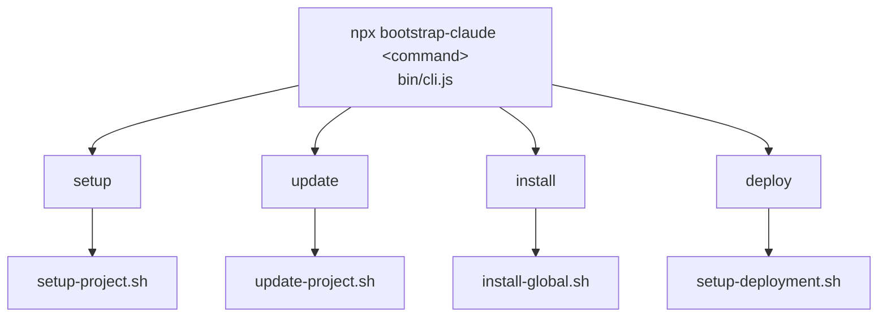

# Architecture: Entry Layer

How a user invokes bootstrap-claude and how commands route to scripts.

```mermaid
flowchart TD
    CLI["npx bootstrap-claude &lt;command&gt;\nbin/cli.js"]

    CLI --> SETUP["setup"]
    CLI --> UPDATE["update"]
    CLI --> INSTALL["install"]
    CLI --> DEPLOY["deploy"]

    SETUP --> S1["setup-project.sh"]
    UPDATE --> S2["update-project.sh"]
    INSTALL --> S3["install-global.sh"]
    DEPLOY --> S4["setup-deployment.sh"]
```
