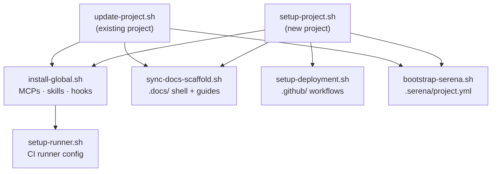

# Architecture: Script Orchestration Layer

Which scripts call which, and what each is responsible for.

```mermaid
flowchart TD
    SETUP["setup-project.sh\n(new project)"]
    UPDATE["update-project.sh\n(existing project)"]

    SETUP --> INST["install-global.sh\nMCPs · skills · hooks"]
    SETUP --> SYNC["sync-docs-scaffold.sh\n.docs/ shell + guides"]
    SETUP --> DEPLOY["setup-deployment.sh\n.github/ workflows"]
    SETUP --> SERENA["bootstrap-serena.sh\n.serena/project.yml"]

    UPDATE --> INST
    UPDATE --> SYNC
    UPDATE --> SERENA

    INST --> RUNNER["setup-runner.sh\nCI runner config"]
```
