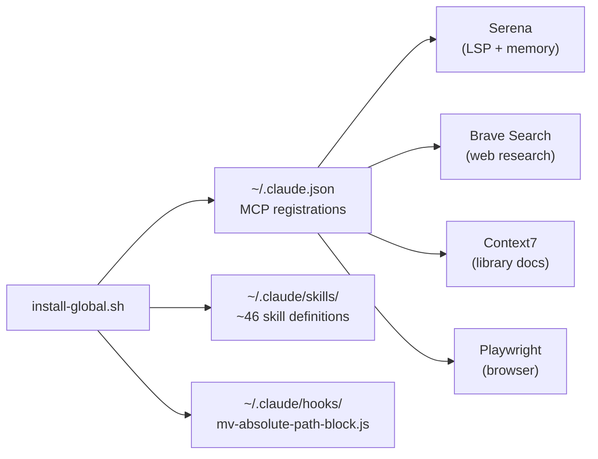

# Architecture: Global Configuration Layer

What `install-global.sh` writes into `~/.claude` (available across all projects).

```mermaid
flowchart LR
    INST["install-global.sh"]

    INST --> MCPS["~/.claude.json\nMCP registrations"]
    INST --> SKILLS["~/.claude/skills/\n~46 skill definitions"]
    INST --> HOOKS["~/.claude/hooks/\nmv-absolute-path-block.js"]

    MCPS --> M1["Serena\n(LSP + memory)"]
    MCPS --> M2["Brave Search\n(web research)"]
    MCPS --> M3["Context7\n(library docs)"]
    MCPS --> M4["Playwright\n(browser)"]
```
