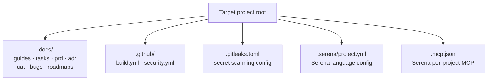

# Architecture: Per-Project Scaffold Layer

What bootstrap-claude writes into a target project (one-time setup).

```mermaid
flowchart TD
    TARGET["Target project root"]

    TARGET --> DOCS[".docs/\nguides · tasks · prd · adr\nuat · bugs · roadmaps"]
    TARGET --> GH[".github/\nbuild.yml · security.yml"]
    TARGET --> GL[".gitleaks.toml\nsecret scanning config"]
    TARGET --> SERENA[".serena/project.yml\nSerena language config"]
    TARGET --> MCP[".mcp.json\nSerena per-project MCP"]
```
