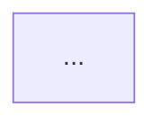

**Prereqs:** obey `.docs/guides/mcp-tools.md`; run /primer if not done this session.
**Run `/research <topic>` on the decision topic BEFORE drafting any decision block. Do not skip.**
**Read `wiki/work/decisions/lifecycle.md` first** — it defines the Decision Group model, supersession rule, relationship graph, and index format this command must respect.

# Create Decision

Create a **Decision Record** file — a **Decision Group** of one or more architecturally significant decisions sharing context, documented together. Each decision tracks its own `Status`, `Date`, `Deciders`, `Tags`, and supersession independently.

Format: a hybrid of [Nygard 2011](https://www.cognitect.com/blog/2011/11/15/documenting-architecture-decisions) + [MADR 4.0](https://adr.github.io/madr/), extended with this project's per-decision status model. **Append-only history:** when a later decision overrides an earlier one, write a **new** decision (new file, or a new `D*` block in a related file) that supersedes the old — never rewrite the past.

**Topic**: $ARGUMENTS

## When to write

See the lifecycle doc's "When to Write" / "When NOT to Write" tables. In short: write when at least one decision affects structure, NFRs, dependencies, interfaces, or construction techniques **and** is hard to reverse. Skip bug fixes, refactors, naming, trivially reversible choices. If it doesn't clear the bar, stop and tell the user — don't pad the log.

---

## Step 1: Parse topic, recall context
1. Extract the core topic from `$ARGUMENTS`; too vague ("auth") → `AskUserQuestion` to narrow.
2. Decide single vs group (Step 1.5).
3. Recall Serena memories that may inform any decision: `list_memories` (filter by topic), `read_memory` for architecture/gotcha/integration memories touching the topic.
4. Read `CLAUDE.md`, `PROJECT_STATUS.md` (if present), `wiki/work/decisions/lifecycle.md`, and a sample of recent decisions for local conventions.

## Step 1.5: Single vs Decision Group triage
Use the lifecycle doc's "When to Group vs Split":

| Signal | Group | Split (write one now, `/decision-create` again later) |
|--------|-------|-------|
| Shared context, drivers, deciders | ✅ | — |
| Tightly coupled (one constrains the next) | ✅ | — |
| Different areas with little overlap | — | ✅ |
| Different audiences / timelines | — | ✅ |
| One much larger than the others | — | ✅ |

Default to **single-decision** unless `$ARGUMENTS` starts with `group:` or the user lists multiple. When in doubt, ask with the table visible. If grouping, request a list (one short title each, 2-6).

## Step 2: Locate directory, assign number
1. Find/create `wiki/work/decisions/`. If creating, add a `lifecycle.md` index and confirm via `AskUserQuestion` first.
2. Read `lifecycle.md` for the current chain, area conventions, graph.
3. Next file number: `list_dir`, highest 4-digit prefix + 1 (first is `0001`).
4. Derive the file slug — names the **group**, lowercase dash-separated ≤60 chars (single: `DEC-0007-session-storage-strategy.md`; group: `DEC-0007-session-management.md`).

## Step 2.5: Detect existing decision area (per-decision supersession check, mandatory)
Prevents two parallel `accepted` decisions in one area (breaks the chain). Per planned decision:
1. `list_dir` + `Read` every existing decision file (exclude `lifecycle.md`).
2. For each existing `accepted` block, score: **Tier 1** ≥1 shared tag · **Tier 2** decision-title noun overlap · **Tier 3** file-slug stem overlap (only when both single-decision files).
3. Build a candidate table per planned decision (Planned Decision, Existing Decision, Overlap Tier, Likely Same Area?).
4. Any `Yes`/`Maybe` → surface in Step 4 and offer to set `Supersedes`; else the block enters a fresh area.

## Step 3: Research each decision
**Invoke `/research <topic>` for each decision** — call the skill directly, not ad-hoc searches. Don't proceed to Step 4 until research for every planned decision is done. Each must produce:

| Section (per decision) | Research must produce |
|------------------------|----------------------|
| Context | code state for *this decision*; constraints from prior decisions; business/compliance forces |
| Decision Drivers | concrete forces: perf budgets, team skill, security, ecosystem fit, deadline |
| Considered Options | ≥2 viable options (Context7 for lib/framework docs; Brave 1/sec sequential for ecosystem patterns) |
| Pros & Cons | symmetric per option |
| Consequences | real follow-on: new deps, migration cost, what gets harder/easier |
| Validation | measurable signal + threshold + timeframe (E-C-A-D-R "R") |

Group members may share evidence sources (Shared Context), but each block needs its own drivers/options/consequences. If a block lacks evidence for an option/driver, **drop it** rather than fabricate; note the gap in Step 9.

## Step 4: Clarify with the user (mandatory)
`AskUserQuestion`, **per decision**, at minimum: (1) **Status** — strongly prefer `proposed` (default); may differ per block. (2) **Recommended option** — present research-backed rec with the comparison table; user confirms/overrides. (3) **Deciders** — owner of *this* decision (may differ per block; default git user). (4) **Tags (mandatory, non-empty)** — 1-3 short tags identifying this block's area (required for supersession detection). (5) **Supersedes** — if Step 2.5 surfaced candidates, ask which (if any): `DEC-NNNN#DM`, `none`, or "decide at finalize time".

**Refuse to write the file if any block has empty `Tags`.** For groups, batch all decisions' questions in one `AskUserQuestion` when feasible, but keep questions per-decision.

## Step 5: Generate the file
Write to `wiki/work/decisions/DEC-NNNN-<group-slug>.md` using this template. **Tables only, mermaid for flows** — mandatory in every block.

````markdown
# DEC-NNNN: <Decision-Group Title>

> Decision Group covering <area-1>, <area-2>, <area-3>.

- **File created**: YYYY-MM-DD
- **Last updated**: YYYY-MM-DD
- **Tags (group)**: <umbrella tags shared by all decisions, optional>

## Shared Context

<Context applying to every decision in the group; don't restate per block. Link code areas (repo-relative), prior decisions ([[DEC-NNNN-slug|DEC-NNNN#DM: title]]), external constraints.>

---

## D1. <Short Title — Verb Phrase>

- **Status**: <proposed | accepted | deprecated | superseded by DEC-XX#DY>
- **Date**: YYYY-MM-DD
- **Deciders**: <names or roles>
- **Consulted**: <optional>
- **Informed**: <optional>
- **Supersedes**: <DEC-MMMM#DK | none>
- **Tags**: <area-1>, <area-2>

### Context (decision-specific)
<Applies to D1 but not siblings; reference Shared Context when possible.>

### Decision Drivers
| # | Driver | Why it matters |
|---|--------|----------------|
| 1 | <e.g. p99 latency budget < 200ms> | <consequence if violated> |

### Considered Options
| Option | One-line summary (≤15 words) |
|--------|------------------|
| **A. <name>** | <…> |
| **B. <name>** | <…> |

### Option Comparison
| Criterion | Option A | Option B |
|-----------|----------|----------|
| Meets driver 1 | ✅ | ⚠️ |
| Implementation cost | Low | Med |
| Operational cost | Low | Low |
| Reversibility | Easy | Hard |

### Trade-off Detail per Option
#### Option A: <name>
| Aspect | Assessment |
|--------|------------|
| Pros | <comma-separated or short prose> |
| Cons | <…> |
| Risks | <known unknowns> |
| Exit cost | <how hard to walk away later> |

<Repeat the same 4-row Aspect table for each remaining option (B, C, …).>

### Decision Outcome
**Chosen option**: **<Option X — name>**, because <one-sentence justification anchored to the highest-priority driver>.

### Decision Flow
<Mermaid block when the decision involves a flow/sequence/state transition; skip only for purely static choices.>


### Consequences
| Type | Consequence |
|------|-------------|
| ✅ Positive | <e.g. eliminates current bottleneck> |
| ⚠️ Negative | <e.g. adds new operational dependency> |
| 🔁 Follow-up | <e.g. write task: instrument metric> |

### Validation
| Signal | Threshold | When measured |
|--------|-----------|---------------|
| <e.g. p99 latency> | < 200ms | 30 days post-deploy |

### Links
- Related decisions: [[DEC-NNNN-slug|DEC-NNNN#DM: title]]
- Supersedes: [[DEC-MMMM-slug|DEC-MMMM#DK: title]] (if applicable)
- Source task(s): `wiki/work/tasks/TASK-NNN-slug.md`

---

## D2. <Short Title of Decision 2>
- **Status**: <independent of D1>
- **Supersedes**: … · **Tags**: …
<repeat the full D1 block structure>

## D3. ...
````

**Single-decision files** have one `D1` block and no `D2`/`D3`; `Shared Context` may merge into D1's `### Context` or be omitted.

## Step 6: Maintain the Decision Index
1. Append to `wiki/work/decisions/index.md`: `- [DEC-NNNN — Title](DEC-NNNN-slug.md) — one-line summary · D1 proposed`.
2. Add **one row per decision** to the Index in `wiki/work/decisions/lifecycle.md` (a 3-decision file adds 3 rows). Columns: `File`, `Decision`, `Title`, `Decision Area`, `Status`, `Date`, `Deciders`, `Supersedes`, `Superseded By` (see lifecycle doc spec).
3. **If any decision was drafted `accepted` AND supersedes an existing one** (rare), apply the two-block cross-reference rule per pair, atomically:
   - **Superseded block:** `Status: accepted` → `superseded by DEC-N#DX`; callout `> **Superseded by [[DEC-NNNN-slug\|DEC-N#DX: title]]** on YYYY-MM-DD` directly under that decision's H2.
   - **Superseded block's siblings:** untouched.
   - **New block:** `Supersedes` metadata; `### Links` references `[[DEC-MMMM-slug\|DEC-MMMM#DK: title]]`.
   - **Index:** two rows updated (superseder gets `Supersedes`; superseded gets `Status` + `Superseded By`).
   - **Graph:** new node; supersession edge; superseded node's class flipped.
   **Default to `proposed`** — create-time supersession is rare; `/decision-finalize` enforces it atomically.
4. Don't delete/mutate existing index rows beyond what supersession requires (append-mostly).

## Step 7: Append to `wiki/log.md` (`Edit`, never `echo >>`)
`## [YYYY-MM-DD] decision-create | DEC-NNNN <Decision-Group Title>`

## Step 8: Cross-link from related artifacts
For any decision prompted by an active task/feature, link both ways (`Read` then `Edit`, never `echo >>`/`sed`): in the source task file append `**Decision**: [[DEC-NNNN-slug|DEC-NNNN#DM: title]]`; in the decision's `### Links` list the source task path.

## Step 9: Update memories
If a decision establishes a non-obvious pattern, integration constraint, or gotcha: `mcp__serena__write_memory` (topic-hierarchical name, e.g. `architecture/data-layer/cache-strategy`), referencing `DEC-NNNN#DM` not just the file. Skip self-documenting decisions.

## Step 10: Report
Tabular summary: File path, Decisions in file (`D1: <title>`, …), Status per decision, Supersession queued for finalize? (per decision), Index updated (N rows), Graph updated (only if any drafted `accepted`), Log appended, Suggested next steps (`/decision-finalize <file>#D1`, …). Note any decision dropped for lack of evidence under a "Gaps" section.

---

## Output formatting rules (mandatory — override default style)
1. **All comparisons are tables** — no bullet pros/cons or option summaries. Writing `- Good/Bad, because …` → convert to a table row.
2. **Mermaid for any flow/sequence/before-after** — static choices may skip; when in doubt, include.
3. **One decision per `D*` block** — never cover two; split into `D1`/`D2`.
4. **Stable decision IDs** — `D2` stays `D2` forever, even if `D1` is later deprecated; never renumber siblings.
5. **Present tense, full sentences** — "We will use Redis as the session cache", not "Redis chosen".
6. **Immutable per decision once accepted** — never edit an accepted block's content; write a superseding decision instead. Only allowed in-place edits: status change (accepted → superseded) + the supersession callout.

## CRITICAL rules
1. **Max 3 sub-processes at a time** if delegating research; **always terminate processes when done**.
2. **Never invent options or consequences** — every option backed by Step 3 research; every consequence a real implication.
3. **Tables not bullets** for every comparison — hard rule.
4. **Mermaid for flows** — include unless purely static.
5. **Per-decision metadata mandatory** — `Status`/`Date`/`Deciders`/`Tags` non-empty on every block; `Tags` non-empty required for supersession detection.
6. **Decisions in a group are independent units** — never assume sibling status, deciders, or supersession on behalf of a block.
